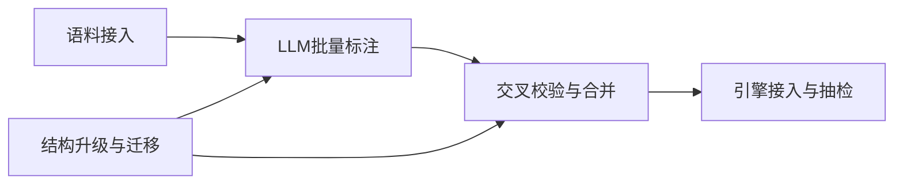
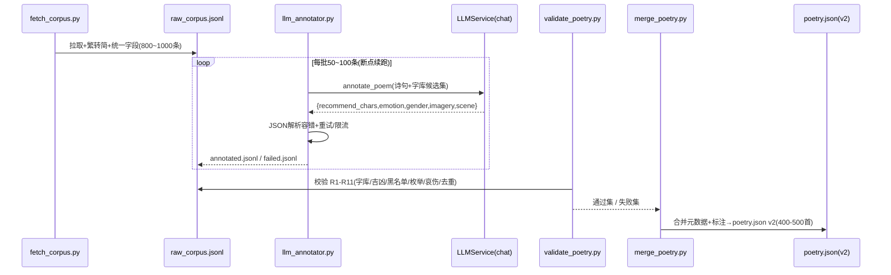
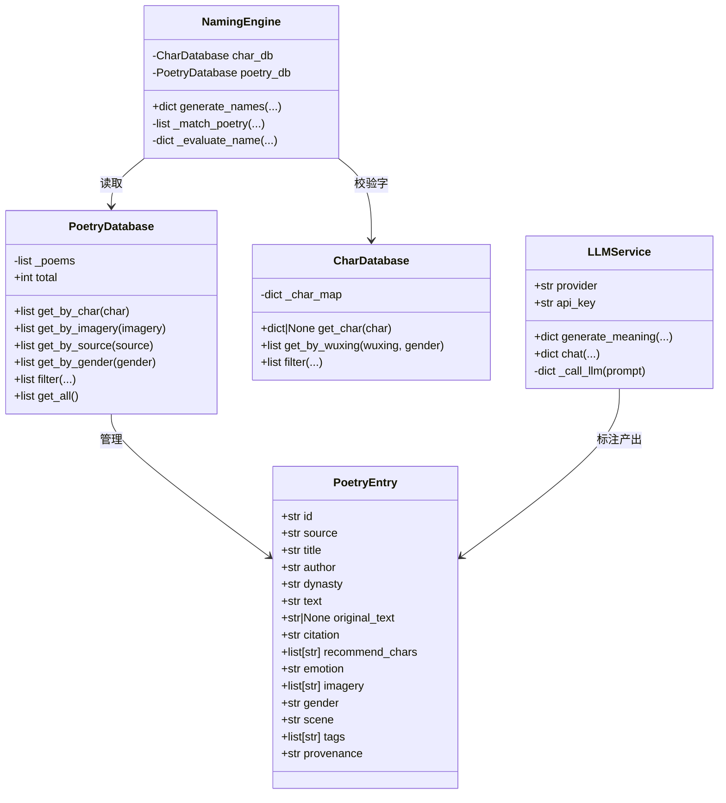

# 美名集 · 诗词库扩充方案设计

> 架构师：高见远
> 项目：/Users/dongxuhui/Newlife/Newlife/
> 目标：诗词库 42 首 → 400-500 首，覆盖诗经/楚辞/唐诗/宋词/汉魏古诗/经史子集，解决「同源诗词起名」差异化不足问题。

---

## 0. 现状诊断（关键结论）

1. **数据规模**：`data/poetry/poetry.json` 仅 42 首（诗经12/楚辞8/唐诗10/宋词8/周易2/大学1/中庸1），去重推荐字约 108 个，同源组名组合严重不足。
2. **source 字段混用**：`source` 既有大类（诗经/楚辞/唐诗/宋词）又有典籍名（周易/大学/中庸），无法统一按「经史子集」检索；需规范化。
3. **字段缺失**：无 `emotion`（无法过滤哀伤）、无 `citation`（出处标注）、无 `original_text`（完整原文，现有 `text` 仅为摘句）。
4. **现有推荐字存在"吉凶"隐患**（实测）：字库 `chars.json` 中 `luck` 字段分布为 `吉=3465 / 凶=57 / 中=18`。现有 42 首的推荐字里，有 **1 个凶字（"夭"）+ 18 个"中"字** 命中非吉（久/关/内/匪/寻/少/故/浪/离/索/绝/能/自/莫/蔓/蚕/阑/雎/故…）。即：扩充时必须**连同旧数据一起重校验/重标注**，不能只校验新数据。
5. **LLM 未接入**：`app/services/llm_service.py` 已有 `LLMService`（DeepSeek/Qwen/GLM，OpenAI 兼容），但 `config.py` 中 `LLM_PROVIDER/LLM_API_KEY/LLM_BASE_URL/LLM_MODEL` 均为空（待填）；且 `LLM_BASE_URL/LLM_MODEL` 在 `LLMService` 里未被消费（base_url/model 写死在 `PROVIDERS` 字典），批量标注需补齐通用 `chat()` 能力与可配置入口。

---

## Part 1 数据结构升级

### 1.1 目标 Schema（v2）

```json
{
  "id": "poem_0001",
  "source": "诗经",
  "title": "大雅·文王",
  "author": "佚名",
  "dynasty": "周",
  "text": "周虽旧邦，其命维新",
  "original_text": "文王在上，於昭于天……周虽旧邦，其命维新。……",
  "citation": "《诗经·大雅·文王》",
  "recommend_chars": ["维", "新"],
  "emotion": "喜庆",
  "imagery": ["革新", "承前启后"],
  "gender": "男",
  "scene": "寄托变革创新之志",
  "tags": ["革新", "家国"],
  "provenance": "chinese-poetry/shijing/大雅·文王"
}
```

### 1.2 字段说明

| 字段 | 类型 | 必填 | 新增/变更 | 说明 |
|------|------|------|-----------|------|
| `id` | string | 是 | **新增** | 稳定唯一主键，格式 `poem_0001`；用于 LLM 标注关联、断点续跑、抽检引用、增量合并去重 |
| `source` | string | 是 | **规范化** | 统一为 **6 大类枚举**：`诗经 / 楚辞 / 唐诗 / 宋词 / 汉魏古诗 / 经史子集`；用于分类检索（`get_by_source`） |
| `title` | string | 是 | 保留 | 篇目名，如「大雅·文王」「离骚」「水调歌头·明月几时有」 |
| `author` | string | 是 | 保留 | 作者，佚名可用「佚名」 |
| `dynasty` | string | 是 | 保留 | 朝代（周/战国/汉/魏/晋/唐/宋…） |
| `text` | string | 是 | 保留 | **摘句**（起名引用句），保持精炼，建议 4~24 字 |
| `original_text` | string | 否 | **新增** | **完整原文/章段**；长文（如《史记》《古文观止》篇目）可只存摘句所在章段；用于溯源与二次标注 |
| `citation` | string | 是 | **新增** | **出处标注**，规范格式 `《典籍名·篇目》`（如《诗经·大雅·文王》《论语·学而》《史记·项羽本纪》），用于前端展示与"有据可循"背书 |
| `recommend_chars` | string[] | 是 | 保留（加约束） | 推荐起名用字；**每个字必须 ∈ chars.json 且 luck=吉**（见 Part 4） |
| `emotion` | string | 是 | **新增** | 枚举 `喜庆 / 中性 / 哀伤`；`哀伤` 条目不进起名候选 |
| `imagery` | string[] | 是 | 保留 | 意象标签 |
| `gender` | string | 是 | 保留 | 枚举 `男 / 女 / 中` |
| `scene` | string | 是 | 保留 | 寓意/场景一句话 |
| `tags` | string[] | 否 | **新增** | 扩展标签（主题/情感/器物等），供后续检索扩展 |
| `provenance` | string | 否 | **新增** | 数据溯源（来源数据集 + 相对路径），用于版权审计与质量追溯 |

### 1.3 向后兼容策略（现有 42 首如何迁移）

**核心原则：只增不改旧字段语义、读层全部 `.get()` 兜底、迁移幂等可重跑。**

1. **version 升级**：`poetry.json` 顶层 `version` 从 `"1.0"` → `"2.0"`，保留 `total` 与 `source_distribution`（后者改为按 6 大类统计）。
2. **旧字段全部保留**：`source/title/author/dynasty/text/recommend_chars/imagery/gender/scene` 语义不变，`NamingEngine` 现有读取逻辑不受影响。
3. **新增字段一次性迁移脚本 `migrate_poetry.py` 补默认值**：
   - `id`：按现有顺序生成 `poem_0001 … poem_0042`（保证稳定、可重跑）。
   - `emotion`：先用规则初判（`imagery/scene` 含「离/伤/愁/悲/寒/冷/凄/感怀/追忆」→ 哀伤或中性；含「喜/乐/欢/团圆/祝愿/得意」→ 喜庆；其余 → 中性），再进 LLM 重标注复核（并入 T3 流水线）。
   - `citation`：由 `source + title` 拼成 `《{source}·{title}》`；对 `周易/大学/中庸` 条目特殊处理（见下）。
   - `original_text`：置 `null`（旧数据只有摘句，无法还原全文，后续如需可回填）。
   - `source` 规范化：把 `周易 / 大学 / 中庸` 三个典籍名归入大类 `经史子集`，典籍名下移到 `citation`/`title`（例：`title="周易·乾卦"` 保持，`source="经史子集"`，`citation="《周易·乾卦》"`）。
   - `provenance`：旧 42 首统一填 `"manual/legacy"`。
4. **读层兜底（`PoetryDatabase._load`）**：加载后统一过一遍 `normalize()`——对缺失字段补默认值（`emotion="中性"`、`citation=""`、`original_text=None`、`tags=[]`），保证任何旧/新数据混用都不抛 `KeyError`。

### 1.4 引擎侧联动改动（最小侵入）

- `PoetryDatabase.get_by_gender()` / `filter()` / `get_all()`：增加 `emotion != "哀伤"` 的默认过滤（或提供 `include_sad` 开关，默认 False）。
- `NamingEngine._match_poetry()`：自然继承上述过滤，哀伤诗不进候选。
- `NamingEngine._evaluate_name()` 的 `poetry` 透传字段补充 `citation`、`original_text`（供前端展示出处与原文，`_generate_meaning` 用 `citation` 替代手拼 `「source·title」`）。

---

## Part 2 数据源评估

### 2.1 结论速览

| 数据源 | 许可证 | 规模 | 诗经 | 楚辞 | 唐诗 | 宋词 | 汉魏古诗 | 经史子集 | 结论 |
|--------|--------|------|------|------|------|------|----------|----------|------|
| **chinese-poetry/chinese-poetry** | **MIT** | 37万+ 篇 | ✅305 全文 | ✅19 篇 | ✅5.5万 | ✅2.1万 | ⚠️ 部分（曹操诗集等） | ⚠️ 论语/孟子/周易/四书五经 ✅；道德经/史记/八大家散文 ❌ | **主源（首选）** |
| wangxb96/Classical-Chinese-Text-Dataset | MIT | 小 | ✅ | ✅ | ❌ | ❌ | ❌ | ✅ 道德经/易经/论语/孟子/庄子 | 补经部缺口 |
| Scagin/CCTC | MIT | 小 | ❌ | ❌ | ❌ | ❌ | ❌ | ✅ 史记(29篇)/论语/中庸 | 补史记 |
| tohosin/Classical-Modern | 有 LICENSE（需核） | 97万句 | ⚠️ | ⚠️ | ⚠️ | ⚠️ | ⚠️ | ✅ 大量古籍原文（含史记/道德经等） | 补古文原文 |
| yxcs/poems-db | **无正式协议** | 22万 | ✅ | ✅ | ✅ | ✅ | ⚠️ | ✅ 经/史/子/集四部 | ⚠️ 仅内参，不打包 |
| 古诗文网 gushiwen.cn | 非开源 | 最全 | ✅ | ✅ | ✅ | ✅ | ✅ | ✅ 全 | ❌ 不程序化抓取 |

### 2.2 主源详解：chinese-poetry/chinese-poetry（推荐）

- **规模**：唐诗约 55,000 首（近 14,000 诗人）、宋诗约 260,000 首、宋词约 21,050 首（1,564 词人）、诗经 305 首全文、楚辞 19 篇全文、论语 20 篇、四书五经整部（含周易/孟子/大学/中庸/尚书/礼记/春秋）、蒙学（三字经/百家姓/千字文）、纳兰词、幽梦影、花间集、南唐二主词、曹操诗集、元曲、五代诗词；总量 37 万+ 篇，GitHub 52K+ Star。
- **覆盖范围**：✅ 诗经/楚辞/唐诗/宋词 + 四书五经类经史；❌ 缺 **道德经（老子）、史记、唐宋八大家散文/古文观止、汉乐府/古诗十九首** 等。
- **获取方式**：`git clone https://github.com/chinese-poetry/chinese-poetry`，或直接下载 `json/`（唐诗、全宋词）、`shijing/`、`chuci/`、`lunyu/`、`sishuwujing/` 等目录；主仓为繁体，配套简体分支 `chinese-poetry-zhCN`。
- **数据格式**：统一 JSON，唐诗 `{author,title,paragraphs:[…],strains:[…]}`、宋词多 `rhythmic`（词牌）；`paragraphs` 为数组，适合拆句/摘句。
- **数据质量**：社区 10 年维护、字段干净、部分标注平仄；存在繁体与个别异文，需「繁转简 + 人工抽检」。
- **许可证**：**MIT**，可自由商用（含 App、AI 训练、商业产品打包），无版权风险。

### 2.3 经史子集缺口补齐（备选）

| 缺口 | 补源 | 说明 |
|------|------|------|
| 道德经/老子 | wangxb96/Classical-Chinese-Text-Dataset | MIT，含 `daodejing.json`，直接可用 |
| 史记 | Scagin/CCTC（史记29篇，MIT）或 tohosin/Classical-Modern（古文原文目录） | 优先 CCTC，结构清晰；缺少的篇目从 Classical-Modern 补 |
| 唐宋八大家散文/古文观止 | tohosin/Classical-Modern 古文原文目录 + 人工精选 | 覆盖面全，但为 txt 结构，需自行切片成「篇目 + 摘句」 |
| 汉魏古诗（古诗十九首/汉乐府/曹操等） | chinese-poetry 的「曹操诗集」+ 人工补录古诗十九首/汉乐府 | 量小，可手工精选 30-50 首直接入库 |

### 2.4 商用合规提醒

- **主源（MIT）**：安全，可直接打包分发。
- **yxcs/poems-db**：作者虽声明"可随意使用"，但**无正式开源协议、且来源为古诗文网**，商用有法律风险 → **只用于人工核对原文，不直接打包进产品**。
- **古诗文网**：内容最全但非开源、无批量授权、爬取违反其服务条款 → **禁止程序化抓取**，仅人工查阅校勘。

---

## Part 3 LLM 批量标注流水线

### 3.1 总体流程

```
原始语料(raw_corpus.jsonl)
   │  1. 摘句（选适合起名的句子）
   ▼
摘句集(poems_to_annotate.jsonl)
   │  2. LLM 标注（annotate_poem）
   ▼
标注结果(annotated.jsonl)
   │  3. 交叉校验（validate，Part 4）
   ▼
通过 → 合并入 poetry.json v2 ；失败 → failed.jsonl（修复/重跑）
   │  4. 人工抽检
   ▼
最终 poetry.json（400-500 首，通过全部校验）
```

### 3.2 输入 / 输出

- **输入**：单条原始语料 `{source, title, author, dynasty, text(摘句), original_text(可选)}`。
- **输出**（结构化 JSON）：
```json
{
  "recommend_chars": ["维", "新"],
  "emotion": "喜庆",
  "gender": "男",
  "imagery": ["革新", "承前启后"],
  "scene": "寄托变革创新之志"
}
```

### 3.3 提示词设计要点（硬约束）

系统提示词需明确角色（"精通姓名学与诗词的专家"）并**把硬规则前置**，用 `few-shot` 给 1-2 个标准示例。用户提示词结构：`【诗句】+【可用字候选集】+【输出 JSON 模板】+【硬性规则】`。

**硬性规则（违反即判无效，需全部满足）**：

1. **推荐字必须在字库内**：`recommend_chars` 每个字必须从下方给出的「可用字候选集」中选取（脚本会从 `chars.json` 预筛 `luck=吉` 且与诗句实际出现的字相交，把候选集作为上下文喂给 LLM，而不是把 3540 字全塞进去）。
2. **五行/字义吉**：推荐字 `luck=吉`、寓意积极；优先选诗句中**实际出现**且吉的字。
3. **避开负面字黑名单**：不得输出黑名单字（黑名单 = `chars.json` 中 `luck=凶` 的 57 字 + 人工补充负面义字，见 Part 4）。
4. **emotion 三选一**：`喜庆 / 中性 / 哀伤`；判定为「哀伤」的诗 → `recommend_chars` 置空数组 `[]` 并标记（不进候选）。
5. **推荐字可组名**：字形端正、声韵协调、不过于冷僻，2~5 个字即可（同名候选从同诗取两字时需音韵连贯）。
6. **只输出 JSON**：严格输出合法 JSON（`response_format=json_object` + temperature 调低至 0.2），不输出解释、不套 markdown 代码块。

### 3.4 批量 / 重试 / 限流

- **复用现状**：`LLMService` 已有 OpenAI 兼容的 `_call_llm`；建议**新增通用 `chat(messages, temperature, max_tokens, json_mode)` 方法**，`generate_meaning` 改为调用它，批量标注也复用它。补齐 `config.py` 中 `LLM_BASE_URL/LLM_MODEL` 的消费逻辑（当前写死在 `PROVIDERS`，未生效）。
- **批量**：`llm_annotator.py` 用 `asyncio` + `Semaphore(3~5)` 并发逐条调用；每批 50~100 条；`id` 为主键，`done_ids.json` 记录已完成，支持**断点续跑**。
- **限流**：并发 3~5；处理 `429/超时`，每次请求间隔可配（如 100~300ms）。
- **重试**：指数退避（1s/2s/4s/8s，最多 3~5 次）；JSON 解析失败自动重试 1 次；仍失败写入 `failed.jsonl`（含 `id + 原始输入 + 错误信息`）。
- **幂等**：同一 `id` 重跑覆盖旧结果，支持增量更新与「只补失败的」。
- **成本**：400-500 首，每首约 1~2 次调用（摘句可用规则，标注 1 次）；优先 `deepseek-chat`（成本低、OpenAI 兼容、支持 JSON mode）。

### 3.5 人工抽检

- **比例**：首轮 10%（约 40~50 条）全人工，稳定后每批随机 5% 抽检。
- **维度**：① 推荐字是否在字库且 luck=吉；② emotion 是否准确；③ 寓意是否积极、无负面字；④ 摘句/出处是否准确（不编造）；⑤ 性别是否合理。
- **工具**：产出 `review_sheet.csv`（id/source/title/text/recommend_chars/emotion/gender/人工结论 accept|reject|fix），人工在表格里打标，脚本汇总通过率并驱动修复。

---

## Part 4 交叉校验规则

设计校验脚本 `scripts/validate_poetry.py`（只描述逻辑，不写实现），作为**入库前置 Gate**：扩充后的 `poetry.json` 必须通过校验才可合入；`PoetryDatabase` 启动时做轻量告警（只 warn 不 crash）。

### 4.1 校验规则清单

| # | 规则 | 判定 | 处理 |
|---|------|------|------|
| R1 | `recommend_chars` 每个字 **必须 ∈ chars.json 字库** | 用 `CharDatabase._char_map` 查存在性 | 不存在 → 剔除/报错 |
| R2 | 每个推荐字 **luck == 吉**（"五行吉"落地为字库 `luck` 字段） | `char.luck == "吉"` | 非吉 → 报错 |
| R3 | **负面字黑名单**：推荐字不得命中黑名单 | 黑名单 = `luck=凶`(57字) ∪ 人工负面义补充集（死/亡/病/哀/愁/怨/凶/灾/殇/丧/败/残/贱/毒/灭/囚/邪/妖/杀/穷/苦/祸/葬/崩/盗/惨/恶/贼 等，即使字库未标凶也强制排除） | 命中 → 报错并列出 |
| R4 | `emotion` 枚举合法 ∈ `{喜庆, 中性, 哀伤}` | 白名单校验 | 非法 → 报错 |
| R5 | `emotion == 哀伤` 时 `recommend_chars` 必须为空，且不进候选 | 一致性校验 | 非空 → 报错 |
| R6 | `gender` ∈ `{男, 女, 中}` | 白名单校验 | 非法 → 报错 |
| R7 | `source` ∈ 6 大类枚举 `{诗经,楚辞,唐诗,宋词,汉魏古诗,经史子集}` | 白名单校验 | 非法 → 报错 |
| R8 | `citation` 非空、格式含典籍名（建议 `《…》`） | 非空 + 正则 | 空/格式错 → warn |
| R9 | `text` 非空且长度 2~30 字 | 长度校验 | 超界 → 报错 |
| R10 | `id` 全局唯一 | 集合去重 | 重复 → 报错 |
| R11 | 条目去重：按 `(source,title,text)` 及 `recommend_chars` 组合查重 | 组合去重 | 重复 → 报错/合并 |

### 4.2 负面字黑名单定义（落地建议）

- **硬黑名单**：`chars.json` 中 `luck=="凶"` 的 57 字（实测：夭亡仇凶丑灭囚饥奴灰死邪劣伤杀危奸穷灾妖苦丧败贫怪毒残殃贱鬼怨哀疫恨埋损恶破贼衰病难患崩盗断惨祸堕葬裂悲溃寒瘟暴魔）。
- **人工补充负面义字**：上述字库未标凶、但起名应避开的字（殇/讳/忌/晦/冥/霉/厄/溃 等），维护在独立配置 `data/dict/blacklist.json` 中，与字库 `luck=凶` 合并为最终黑名单。
- **"中"字（18 个：久关内匪寻少故浪离索绝能自莫蔓蚕阑雎）**：属中性、非负面，**不纳入硬黑名单**；但 LLM 标注约束「五行吉」时默认优先吉字，中字仅在诗句意境极强时由**人工放行**。→ 这是对现有 42 首（含 18 个中字）的关键处置：一刀切会误删大量诗，需人工复核而非脚本硬删。

### 4.3 校验脚本逻辑（伪流程）

```
load chars.json -> char_map, blacklist = (luck==凶) ∪ blacklist.json
load poetry.json -> poems
for each poem:
    errs = []
    if emotion not in {喜庆,中性,哀伤}: errs.append(R4)
    if gender not in {男,女,中}: errs.append(R6)
    if source not in 6大类: errs.append(R7)
    if not citation: errs.append(R8-warn)
    if not (2<=len(text)<=30): errs.append(R9)
    if id 重复: errs.append(R10)
    if (source,title,text) 重复: errs.append(R11)
    if emotion == 哀伤 and recommend_chars: errs.append(R5)
    for ch in recommend_chars:
        if ch not in char_map: errs.append(R1)
        elif char_map[ch].luck != 吉: errs.append(R2)
        if ch in blacklist: errs.append(R3)
    if errs: failed.append({id, errs})
print 通过/失败统计 + failed.json
exit 0 仅当 failed 为空（CI gate）
```

---

## Part 5 任务分解（交付工程师）

> 说明：遵循「≤5 个任务、按功能模块/层次分组、任务间依赖尽量浅」原则。T1/T2 可并行，其余线性依赖。

| 任务 | 名称 | 依赖 | 优先级 | 产出物 |
|------|------|------|--------|--------|
| **T1** | 语料接入与预处理 | — | P0 | 统一中间语料 `raw_corpus.jsonl` |
| **T2** | 数据结构升级与迁移 | — | P0 | schema v2 + 迁移脚本 + poetry.json v2（42 首迁移完成） |
| **T3** | LLM 批量标注流水线 | T1, T2 | P0 | 标注脚本 + `annotated.jsonl` |
| **T4** | 交叉校验与合并入库 | T2, T3 | P0 | 校验脚本 + 黑名单 + 最终 poetry.json（400-500 首，通过校验） |
| **T5** | 引擎接入与抽检收尾 | T4 | P1 | 引擎 emotion 过滤 + 抽检报告 + 差异化验收 |

### T1 语料接入与预处理
- **Source Files**：`scripts/fetch_corpus.py`、`scripts/normalize_corpus.py`、`data/poetry/raw_corpus.jsonl`、`scripts/requirements.txt`（或复用 `requirements.txt`）
- **内容**：拉取 chinese-poetry（诗经/楚辞/唐诗/宋词/四书五经）+ 补充源（道德经/史记/八大家散文/古诗十九首）；繁体转简体（`opencc`）；统一成中间格式 `{source, title, author, dynasty, text, original_text, citation, provenance}`；按 6 大类预筛出 800~1000 条候选（冗余，供后续精选 400-500）。
- **产出物**：`raw_corpus.jsonl`（字段统一、简体、去明显脏数据）。

### T2 数据结构升级与迁移
- **Source Files**：`data/poetry/poetry.schema.json`、`scripts/migrate_poetry.py`、`app/services/poetry_database.py`（`_load` 增加 `normalize()` 兜底）、`data/poetry/poetry.json`（升级 v2）
- **内容**：定义 v2 schema（Part 1）；迁移脚本对现有 42 首补 `id/emotion/citation/original_text/provenance`、`source` 归入 6 大类；`PoetryDatabase` 读层加默认值兜底与 `get_by_gender/filter` 预留 emotion 过滤接口。
- **产出物**：schema 文件、迁移脚本、可重跑的 v2 数据、向后兼容的读层。

### T3 LLM 批量标注流水线
- **Source Files**：`app/services/llm_service.py`（新增通用 `chat()` + 补 `LLM_BASE_URL/LLM_MODEL` 消费）、`scripts/llm_annotator.py`、`scripts/prompts/annotate_prompt.py`、`data/poetry/annotated.jsonl`、`data/poetry/failed.jsonl`
- **内容**：实现 `annotate_poem()` 提示词（Part 3.3）、批量/并发/限流/指数退避/断点续跑/JSON 解析容错；输出 `recommend_chars/emotion/gender/imagery/scene`。
- **产出物**：标注脚本 + 标注结果（含失败清单，可断点续跑）。

### T4 交叉校验与合并入库
- **Source Files**：`scripts/validate_poetry.py`、`data/dict/blacklist.json`、`scripts/merge_poetry.py`、`data/poetry/poetry.json`（合并后终版）
- **内容**：实现 Part 4 全部校验规则（R1-R11）+ 负面字黑名单配置；合并脚本把 `raw_corpus` 的元数据 + `annotated` 的标注合并成 400-500 首，**必须通过校验才产出**；对哀伤条目清空推荐字；对"中"字人工复核。
- **产出物**：校验脚本（CI Gate）、黑名单、最终 poetry.json（400-500 首，通过校验）。

### T5 引擎接入与抽检收尾
- **Source Files**：`app/services/poetry_database.py`、`app/services/naming_engine.py`（emotion 过滤 + citation/original_text 透传）、`docs/review_report.md`、`docs/acceptance.md`
- **内容**：`_match_poetry`/`get_by_gender` 默认排除 `emotion=哀伤`；`_evaluate_name`/`_generate_meaning` 透传并展示 `citation/original_text`；人工抽检 10% + 5% 随机；回归验证「同源组名差异化」指标（去重推荐字数、每诗可用字、组名覆盖数 vs 扩充前）。
- **产出物**：引擎改动、抽检报告、验收清单（去重推荐字 108 → 预期 ≥400；同源组名组合数显著提升）。

### 依赖关系图



### 实现顺序建议

1. **T1 + T2 并行开工**（互不阻塞：T1 拉新语料，T2 动旧数据与读层）。
2. **T3** 在 T1 语料 + T2 字库候选/枚举就绪后启动（需先填 `LLM_API_KEY`）。
3. **T4** 依赖 T2 的 schema 与 T3 的标注结果，产出终版数据。
4. **T5** 依赖 T4 终版数据，做引擎联动 + 抽检 + 验收。

---

## 附：共享约定（Shared Knowledge）

- 所有新增数据字段读取一律 `.get(key, 默认值)`，旧数据不报错。
- `emotion` 枚举仅 `喜庆/中性/哀伤` 三值；`gender` 仅 `男/女/中`；`source` 仅 6 大类。
- 负面字黑名单 = `chars.json` 中 `luck=凶`(57字) ∪ `data/dict/blacklist.json` 人工补充；`luck=中`(18字) 属中性，不硬删，人工复核。
- 推荐字硬约束：`∈ chars.json` 且 `luck=吉` 且 ∉ 黑名单。
- `poetry.json` 顶层保留 `version/total/source_distribution/poems` 结构；`version` 升到 `2.0`。
- 所有日期/朝代用中文短名（周/战国/汉/唐/宋…），不引入额外时间格式。
- LLM 批量标注：temperature=0.2、`response_format=json_object`、并发 3~5、指数退避重试、以 `id` 幂等、断点续跑。

---

## 附：关键时序图（LLM 标注流水线）



## 附：核心数据结构类图


