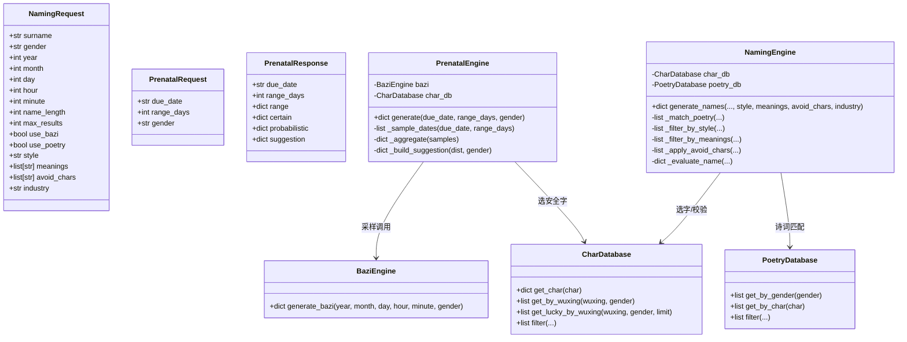
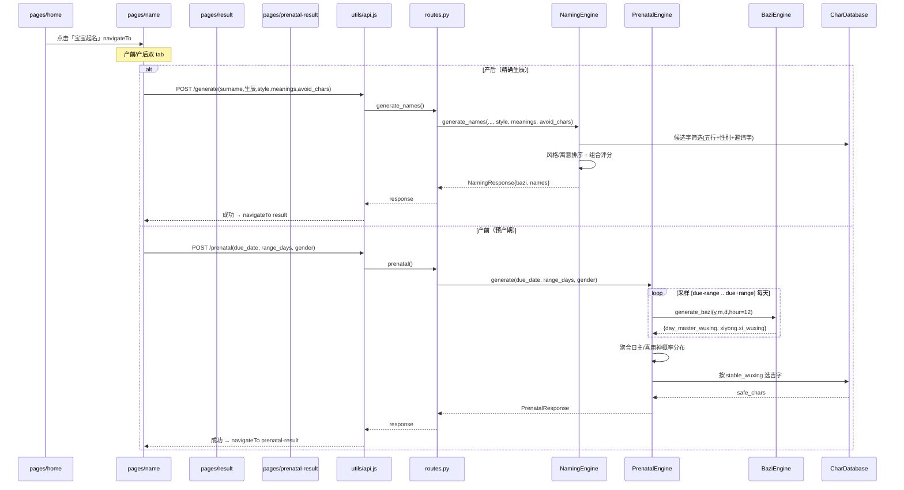
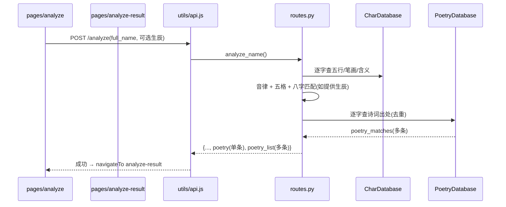
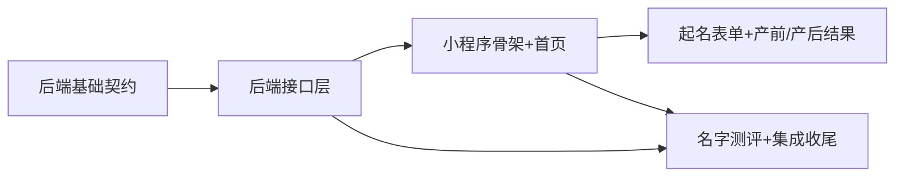

# 美名集 · 首页改版迭代技术设计

> 架构师：高见远
> 项目：/Users/dongxuhui/Newlife/Newlife/
> 目标：首页改版为人群分类页，本迭代交付 P0（首页分类 + 产前预产期起名 + 产后精确起名 + 名字测评），成人改名/创意起名作为紧随 P1，接口与数据模型一次性预留可扩展。

---

## Part A：系统设计

### 1. 实现方案与技术选型

#### 1.1 现状结论（已读码确认）

- 后端为 FastAPI，严格四层架构：`api/routes.py`（路由）→ `schemas/schemas.py`（Pydantic 契约）→ `services/`（业务引擎）→ `core/`（常量/配置/解释）。现有接口：`GET /health`、`POST /generate`、`POST /analyze`、`GET /chars`、`GET /poetry`、`GET /bazi`。
- 八字引擎 `BaziEngine.generate_bazi(year, month, day, hour=12, minute=0, gender)` 已产出完整排盘，关键字段：`four_pillars`、`day_master`、`day_master_wuxing`、`shengxiao`、`wuxing.percentages`、`xiyong.xi_wuxing / yong_wuxing / ji_wuxing`。**这是近似版（立春/节气用固定日期近似），沿用即可，不引精确节气表。**
- 字库 `data/dict/chars.json`（3540 字），字段含 `char/pinyin/wuxing/luck/gender/meaning/kangxi_strokes`，**无风格、无寓意标签**。诗词库 `data/poetry/poetry.json`（42 首），字段含 `source/title/author/text/recommend_chars/imagery/gender/scene`，**有 `imagery`(意象标签) + `scene`(寓意一句话)，可作寓意匹配锚点**。
- 前端为**原生微信小程序**（无框架），页面：`index`(起名表单)/`result`(结果)/`detail`(名字详情)/`bazi`(八字详解)，网络层集中在 `utils/api.js`。

#### 1.2 核心难点与对策

| 难点 | 对策 |
|------|------|
| 预产期未出生，时辰未知，无法精确排盘 | 不做确定性排盘，改为**「孕期参考/范围建议」**：以预产期为中心 ±N 天、固定 `hour=12`（午时）遍历采样，聚合出日主/喜用神的**概率分布** |
| 风格/寓意标签在字库、诗词库中缺失 | 新增**纯常量映射层**（不污染数据文件），用关键词匹配 `poetry.imagery/scene` 与 `chars.meaning`，轻量、可维护、P1 可替换为 LLM 标注 |
| 首页要从「起名表单」改为「人群分类」 | 新增 `pages/home` 为启动页，原 `index` 起名表单逻辑平迁到 `pages/name`，并叠加产前/产后双 tab |
| 名字测评要复现「诗词出处多条」 | `/analyze` 小改：保留 `poetry`（单条，兼容 result/detail），新增 `poetry_list`（多条）供测评页展示 |

#### 1.3 技术选型（复用为主，零新增依赖）

- **后端**：沿用 FastAPI + Pydantic v2 + `lunardate`；概率分布聚合用**纯 Python dict + collections.Counter**，无 numpy/pandas。
- **前端**：沿用原生小程序 `wx.request`；概率分布柱状条用**原生 `<view>` + 内联 `style="width:{{x}}%"`** 渲染，不引 echarts/vant。
- **架构分层**：严格沿用现有四层（路由 → Schema → Service → Core），新增 `PrenatalEngine` 归属 `services/`，新增映射常量归属 `core/`，不引入新框架、不改变现有分层。

---

### 2. 文件列表（相对路径）

#### 2.1 后端（新增/改造）

| 文件 | 动作 | 说明 |
|------|------|------|
| `app/core/constants.py` | 改造 | 追加 `RANGE_OPTIONS`、`DEFAULT_RANGE_DAYS`、`MEANING_MAX_SELECT` |
| `app/core/naming_options.py` | **新增** | 风格枚举 `STYLE_OPTIONS`、寓意枚举 `MEANING_OPTIONS`、行业→五行 `INDUSTRY_WUXING` |
| `app/schemas/schemas.py` | 改造 | 新增 `PrenatalRequest/PrenatalResponse`；`NamingRequest` 扩展 `style/meanings/avoid_chars/industry` |
| `app/services/prenatal_engine.py` | **新增** | `PrenatalEngine`：预产期采样聚合 + 建议生成 |
| `app/services/naming_engine.py` | 改造 | `generate_names` 扩展风格/寓意/避讳字过滤（行业仅透传预留） |
| `app/services/char_database.py` | 改造(可选) | 增加 `get_lucky_by_wuxing(wuxing, gender, limit)` 便捷方法（供选字） |
| `app/api/routes.py` | 改造 | 新增 `POST /prenatal`；`/generate` 透传新参数；`/analyze` 返回 `poetry_list` |
| `tests/test_prenatal.py` | **新增** | 预产期引擎单测（采样点数、分布归一化、stable 五行） |

#### 2.2 前端（小程序，新增/改造）

| 文件 | 动作 | 说明 |
|------|------|------|
| `miniprogram/app.json` | 改造 | `pages` 首项改为 `pages/home/home`；移除 `pages/index/index`；注册新页面 |
| `miniprogram/utils/api.js` | 改造 | 新增 `prenatal()`、`analyzeName()`（已存在，扩展返回解析）；新增 `generateNames` 透传新参数 |
| `miniprogram/pages/home/home.{js,wxml,wxss,json}` | **新增** | 首页人群分类：4 入口卡片 + 「更多」折叠（置灰"即将上线"） |
| `miniprogram/pages/name/name.{js,wxml,wxss,json}` | **新增** | 起名表单（产前/产后双 tab），产后平迁自原 index |
| `miniprogram/pages/prenatal-result/prenatal-result.{js,wxml,wxss,json}` | **新增** | 产前建议结果页（确定性 + 概率分布柱状条 + 建议） |
| `miniprogram/pages/analyze/analyze.{js,wxml,wxss,json}` | **新增** | 名字测评表单（姓名 + 可选生辰） |
| `miniprogram/pages/analyze-result/analyze-result.{js,wxml,wxss,json}` | **新增** | 名字测评结果页（含诗词出处多条） |
| `miniprogram/pages/result/result.{js,wxml}` | 改造 | 微调（返回入口、分享 path） |
| `miniprogram/pages/detail/detail.js` | 改造 | `onShareAppMessage.path` 由 `/pages/index/index` 改为 `/pages/home/home` |
| `miniprogram/pages/index/index.{js,wxml,wxss,json}` | **删除** | 功能已平迁至 `pages/name` |

> 说明：保留 `result/detail/bazi` 三页不动（产后结果展示沿用），仅改分享 path 与返回入口，最小侵入。

---

### 3. 数据结构与接口设计

#### 3.1 新增接口 `POST /api/v1/prenatal`（预产期起名）

**定位**：孕期参考 / 范围建议，不返回名字列表（名字生成仍在产后 `/generate`）。

##### 请求 Schema（`PrenatalRequest`）

```python
class PrenatalRequest(BaseModel):
    due_date: str = Field(..., description="预产期 YYYY-MM-DD")
    range_days: int = Field(7, description="预产期前后浮动天数，取值 0|3|7|14")
    gender: Optional[str] = Field("male", pattern="^(male|female)$", description="性别，用于候选字推荐")
```

请求 JSON 示例：

```json
{
  "due_date": "2025-06-15",
  "range_days": 7,
  "gender": "male"
}
```

##### 响应 Schema（`PrenatalResponse`）

```python
class PrenatalResponse(BaseModel):
    due_date: str
    range_days: int
    range: dict                      # {"start": "YYYY-MM-DD", "end": "YYYY-MM-DD"}
    certain: dict                    # 确定性结果（与预产期强绑定）
    probabilistic: dict              # 概率分布结果（采样聚合）
    suggestion: dict                 # 起名建议（稳定五行 + 安全候选字 + 说明）
```

响应 JSON 示例：

```json
{
  "due_date": "2025-06-15",
  "range_days": 7,
  "range": { "start": "2025-06-08", "end": "2025-06-22" },
  "certain": {
    "shengxiao": "蛇",
    "month_ganzhi": "壬午",
    "month_wuxing": "火"
  },
  "probabilistic": {
    "day_master_wuxing_dist": { "金": 0.20, "木": 0.20, "水": 0.20, "火": 0.20, "土": 0.20 },
    "xiyong_wuxing_dist":    { "金": 0.16, "木": 0.20, "水": 0.24, "火": 0.20, "土": 0.20 }
  },
  "suggestion": {
    "stable_wuxing": ["水", "木"],
    "safe_chars": [
      { "char": "涵", "pinyin": "han", "wuxing": "水", "kangxi_strokes": 12, "meaning": "包容、涵养" },
      { "char": "泽", "pinyin": "ze",  "wuxing": "水", "kangxi_strokes": 17, "meaning": "恩泽、润泽" }
    ],
    "note": "预产期附近（6/8~6/22）出生，生肖为蛇，月柱壬午属火。喜用神五行以水、木概率最高（水24%、木20%），建议名字优先用水、木属性字，避开忌神对应的过强五行。数据为孕期范围参考，出生后可精确起名复核。"
  }
}
```

**字段说明**：

- `certain.shengxiao`：取 `due_date` 当天 `BaziEngine.generate_bazi` 的 `shengxiao`（由年柱地支决定，跨立春已由近似引擎处理）。
- `certain.month_ganzhi / month_wuxing`：取 `due_date` 当天 `four_pillars.month` 及其地支五行（月柱在 ±14 天内基本稳定，近似版不做跨节气精确校正，见"待明确事项"）。
- `probabilistic.*_dist`：键为五行（金木水火土），值为 0~1 概率，**各键之和 ≈ 1**。
- `suggestion.stable_wuxing`：`xiyong_wuxing_dist` 中概率最高且 ≥ 阈值（默认 0.15）的 Top2 五行。
- `suggestion.safe_chars`：稳定五行对应的「吉」字候选（每个五行取 ≤6 个，`luck == 吉` 且性别匹配）。
- `suggestion.note`：一段面向用户的说明文案，前端直接展示。

#### 3.2 `PrenatalEngine` 采样聚合算法

**核心思路**：以预产期为中轴，遍历 `[due_date - range_days, due_date + range_days]` 每一天，每天用**固定 `hour=12`（午时）**调用一次 `BaziEngine.generate_bazi`，采集「日主五行」与「喜用神五行」，最后归一化为概率分布。

```
PrenatalEngine.generate(due_date, range_days, gender):
    dates = [due_date - range_days ... due_date + range_days]   # 共 2*range_days + 1 天
    day_master_counter = Counter()
    xiyong_counter     = Counter()
    total_xi_votes     = 0

    for each d in dates:
        bazi = BaziEngine.generate_bazi(d.year, d.month, d.day, hour=12, gender=gender)
        day_master_counter[bazi["day_master_wuxing"]] += 1          # 日主五行 +1
        for w in bazi["xiyong"]["xi_wuxing"]:                        # 喜用神列表(身强3个/身弱2个)
            xiyong_counter[w] += 1
            total_xi_votes += 1

    day_master_dist = {w: day_master_counter[w] / len(dates) for w in WUXING_LIST}
    xiyong_dist     = {w: xiyong_counter[w] / total_xi_votes for w in WUXING_LIST}

    certain = 由 due_date 当天排盘提取 shengxiao / month_ganzhi / month_wuxing
    stable  = xiyong_dist 按概率降序取 Top2 且概率 >= 0.15
    safe_chars = [char_db.get_lucky_by_wuxing(w, gender, limit=6) for w in stable]
    note   = 组装说明文案

    return {due_date, range_days, range, certain, probabilistic, suggestion}
```

**关键约束与边界**：

1. **采样点数**：`range_days=0 → 1 天`、`=3 → 7 天`、`=7 → 15 天`、`=14 → 29 天`。恒为奇数，分布对称。
2. **固定午时**：`hour=12` 是「时辰未知」的合理代表值，避免对每个时辰再展开（否则 12 时辰 × N 天，量级膨胀且无必要）。PRD 明确定位"范围参考"，午时采样已足够。
3. **归一化**：`day_master_dist` 分母 = 采样天数；`xiyong_dist` 分母 = 喜用神总票数（因身强身弱喜神个数不同，不能简单除以天数）。两者各自保证键值之和 ≈ 1。
4. **不引节气表**：完全复用现有 `BaziEngine.generate_bazi`（近似版），不新增立春/节气精确查表。
5. **单点退化**：`range_days=0` 时分布退化为该天的确定性结果，`stable_wuxing` 直接取该天 `xi_wuxing` 去重取前 2，逻辑自然兼容。

#### 3.3 `POST /generate` 参数扩展

##### `NamingRequest` 扩展字段（均 Optional，向前兼容）

```python
class NamingRequest(BaseModel):
    # —— 原有字段不变 ——
    surname: str = Field(..., min_length=1, max_length=4)
    gender: str = Field("male", pattern="^(male|female)$")
    year: Optional[int] = None
    month: Optional[int] = None
    day: Optional[int] = None
    hour: Optional[int] = 12
    minute: Optional[int] = 0
    name_length: int = Field(2, ge=1, le=2)
    max_results: int = Field(20, ge=1, le=50)
    use_bazi: bool = True
    use_poetry: bool = True
    # —— 新增字段（全部 Optional，缺省不影响旧流程）——
    style: Optional[str] = Field(None, description="风格偏好: classic|modern|grand|fresh")
    meanings: Optional[list[str]] = Field(None, max_length=3, description="期望寓意，最多3个")
    avoid_chars: Optional[list[str]] = Field(None, description="避讳字（单个汉字列表）")
    industry: Optional[str] = Field(None, description="行业 code，映射五行（P1 成人改名/品牌店名启用）")
```

请求 JSON 示例（产后精确 + 新参数）：

```json
{
  "surname": "王",
  "gender": "male",
  "year": 2025, "month": 6, "day": 15, "hour": 12, "minute": 0,
  "name_length": 2,
  "max_results": 20,
  "use_bazi": true,
  "use_poetry": true,
  "style": "classic",
  "meanings": ["wisdom", "virtue"],
  "avoid_chars": ["伟", "强"],
  "industry": null
}
```

**引擎侧落点（`NamingEngine.generate_names`）**：

1. `style`：在 `_match_poetry` 后，按 `STYLE_OPTIONS[style]["source_preference"]` 将匹配诗词排序（优先来源排前），按 `imagery_keywords` 做**软过滤**（命中关键词的诗优先，不硬删，保证候选量充足）。
2. `meanings`：取 `MEANING_OPTIONS` 各寓意 `keywords` 的并集，与 `poem.imagery/scene` 匹配，命中者排前；候选字则对 `char.meaning` 做关键词命中排序。
3. `avoid_chars`：在候选字与组合阶段**硬剔除**（等价于追加到 `NEGATIVE_CHARS` 的本次会话黑名单）。
4. `industry`：P0 仅透传并存储，**不参与 P0 起名打分**；P1 接入 `INDUSTRY_WUXING` 作为补充偏好（见"待明确事项"）。

#### 3.4 风格/寓意 → 候选字/诗词 匹配映射

新增常量文件 `app/core/naming_options.py`（单一事实来源，前后端共享语义）：

```python
# 风格枚举：code -> 中文名/描述/优先来源/意象关键词/选字倾向
STYLE_OPTIONS = {
    "classic": {
        "name": "古风雅致",
        "source_preference": ["诗经", "楚辞", "汉魏古诗"],
        "imagery_keywords": ["风雅", "古典", "清雅", "雅正", "怀古"],
        "char_hint": "偏好玉/丝/木/水等雅致部首，笔画适中",
    },
    "modern": {
        "name": "现代简约",
        "source_preference": ["唐诗", "宋词"],
        "imagery_keywords": ["简约", "明快", "清新", "自然"],
        "char_hint": "偏好常用、笔画简洁、易读易写的字",
    },
    "grand": {
        "name": "大气沉稳",
        "source_preference": ["经史子集", "汉魏古诗"],
        "imagery_keywords": ["宏大", "沉稳", "家国", "志向", "山川"],
        "char_hint": "偏好笔画厚重、意象宏阔的字",
    },
    "fresh": {
        "name": "清新灵动",
        "source_preference": ["唐诗", "宋词", "诗经"],
        "imagery_keywords": ["灵动", "清新", "山水", "花木", "晨露"],
        "char_hint": "偏好草木/水/风等清新意象字",
    },
}

# 寓意枚举：code -> 中文名 + 匹配关键词（用于匹配 poetry.imagery/scene 与 chars.meaning）
MEANING_OPTIONS = {
    "wisdom":  {"name": "智慧", "keywords": ["智慧", "聪明", "博学", "睿智", "才思", "聪慧"]},
    "health":  {"name": "健康", "keywords": ["健康", "长寿", "康健", "安康", "松柏", "强健"]},
    "bravery": {"name": "勇敢", "keywords": ["勇敢", "坚毅", "刚强", "无畏", "勇毅", "果敢"]},
    "gentle":  {"name": "温婉", "keywords": ["温婉", "温柔", "娴静", "淑雅", "婉约", "柔美"]},
    "wealth":  {"name": "富贵", "keywords": ["富贵", "富足", "荣华", "昌盛", "丰裕", "兴旺"]},
    "peace":   {"name": "平安", "keywords": ["平安", "安宁", "祥和", "顺遂", "宁静", "安稳"]},
    "talent":  {"name": "才华", "keywords": ["才华", "文采", "才情", "聪颖", "才俊", "卓越"]},
    "virtue":  {"name": "品德", "keywords": ["品德", "德行", "仁德", "贤良", "高洁", "正直"]},
}

MEANING_MAX_SELECT = 3  # 寓意最多选 3 个

# 预产期浮动档位
RANGE_OPTIONS = [0, 3, 7, 14]
DEFAULT_RANGE_DAYS = 7
```

**匹配策略（轻量、不硬删）**：寓意/风格匹配均为**排序加权而非硬过滤**——命中关键词的诗词/字排前，未命中的仍保留兜底，避免"寓意+风格"双条件把候选集过滤到过小。核心 `_evaluate_name` 的评分结构不变，只在其上游做候选排序。

#### 3.5 行业 → 五行映射常量

```python
# 行业 code -> 五行（成人改名/品牌店名 P1 使用，P0 仅定义常量并透传 industry 字段）
INDUSTRY_WUXING = {
    "tech":          "火",  # 互联网/科技/IT
    "media":         "火",  # 传媒/文创/设计
    "catering":      "火",  # 餐饮
    "energy":        "火",  # 能源
    "finance":       "金",  # 金融/财会/证券
    "law":           "金",  # 法律
    "manufacturing": "金",  # 制造/工业/五金
    "education":     "木",  # 教育/文化/出版
    "medical":       "木",  # 医疗/健康
    "art":           "木",  # 艺术
    "agriculture":   "木",  # 农业
    "realestate":    "土",  # 地产/建筑/工程
    "trade":         "水",  # 贸易/物流/航运
    "tourism":       "水",  # 旅游/服务
}
```

#### 3.6 `POST /analyze` 小改（诗词出处多条）

现有 `/analyze` 返回 `poetry` 为单条（`poetry_matches[0]`）。改为：

```python
poetry_matches = []   # 去重后的多条
...
return {
    ...,
    "poetry":      poetry_matches[0] if poetry_matches else None,  # 兼容旧前端（result/detail）
    "poetry_list": poetry_matches[:3],                              # 新增：多条，最多3条
}
```

- 前端 `analyze-result` 读 `poetry_list` 渲染多条出处；旧 `result/detail` 继续读单条 `poetry`，零破坏。

#### 3.7 核心类图



---

### 4. 程序调用流程（时序图）

#### 4.1 首页 → 起名（产前/产后）主流程



#### 4.2 名字测评流程



---

### 5. Anything UNCLEAR（待明确事项）

1. **风格/寓意枚举 code 命名**：本设计用英文 code（`classic/modern/grand/fresh`、`wisdom/health/...`），前端展示中文名由 `naming_options.py` 与前端常量镜像。若偏好直接用中文枚举值，需同步调整 Schema 与前端。
2. **行业枚举完整清单**：P1 才启用，P0 只给了 14 个常用行业映射。完整清单（含细分行业）建议 P1 时与产品对齐后补全。
3. **创意起名「无姓」**：PRD 决策 5 要求创意起名默认无姓、仅生成 1-2 字名。当前 `NamingRequest.surname` 为必填（`min_length=1`），且 `WugeScorer.calculate` 依赖姓氏。本迭代**不改 surname 必填**，仅在"待明确"记录：P1 放开 `surname` 为可选 + `has_surname` 标志 + 无姓五格降级策略，需单独评估。
4. **预产期月柱跨节气近似**：`certain.month_ganzhi/month_wuxing` 取 `due_date` 当天值，若 `due_date` 恰在节气边界附近（±1~2 天），近似版月柱可能与精确值有 1 个地支偏差。本迭代接受（定位为"范围参考"），是否要在文案里加"以出生后精确排盘为准"的免责声明，由产品确认措辞。
5. **首页 index 处置**：本设计建议**删除 `pages/index`**（功能平迁 `pages/name`，分享 path 改 `home`）。若希望保留旧入口兜底，可改为 301 式 `wx.redirectTo('/pages/home/home')`，请产品/主理确认。
6. **产前结果是否提供「一键生成名字」**：P0 建议 `prenatal-result` 仅展示建议（稳定五行 + 安全字 + 文案），不接 `/generate`；出生后走产后 tab。是否需要在孕期就先用稳定五行试生成一批候选名，可作 P1 增强。

---

## Part B：任务分解

### 6. Required Packages（依赖包）

**零新增第三方依赖。** 复用现有 `requirements.txt`：

```
fastapi==0.115.0            # 后端框架（沿用）
uvicorn[standard]==0.30.0   # ASGI 服务（沿用）
pydantic==2.9.0             # 数据校验（沿用）
pydantic-settings==2.5.0    # 配置（沿用）
lunardate==0.2.2            # 公历转农历/生肖（沿用）
pypinyin==0.53.0            # 拼音（沿用）
python-dateutil==2.9.0      # 日期计算（PrenatalEngine 采样日期偏移）
pytest==8.3.0 / pytest-asyncio==0.24.0 / httpx==0.27.0  # 测试（沿用）
```

> 前端原生小程序，概率柱状条用原生 `view`，无需任何新依赖。

### 7. Task List（本迭代仅排 P0，P1 仅标注不排）

| Task | 名称 | 依赖 | 优先级 |
|------|------|------|--------|
| **T01** | 后端基础契约：枚举常量 + Schema + 预产期引擎 | — | P0 |
| **T02** | 后端接口层：/prenatal + /generate 扩展 + /analyze 小改 | T01 | P0 |
| **T03** | 小程序骨架 + 首页人群分类 | T02 | P0 |
| **T04** | 起名表单 + 产前结果 + 产后结果联动 | T03 | P0 |
| **T05** | 名字测评页 + 集成收尾 | T02, T03 | P0 |
| （P1） | 成人改名 / 创意起名 / 品牌店名（行业参数） | T05 | P1 |

#### T01 后端基础契约（P0）
- **Source Files**：`app/core/constants.py`、`app/core/naming_options.py`(新增)、`app/schemas/schemas.py`、`app/services/prenatal_engine.py`(新增)
- **内容**：追加 `RANGE_OPTIONS/DEFAULT_RANGE_DAYS/MEANING_MAX_SELECT` 常量；新建 `naming_options.py`（`STYLE_OPTIONS`/`MEANING_OPTIONS`/`INDUSTRY_WUXING`）；Schema 新增 `PrenatalRequest/PrenatalResponse`、`NamingRequest` 扩展 4 个可选字段；实现 `PrenatalEngine` 采样聚合 + 建议生成。
- **验收**：`PrenatalEngine.generate` 对 `range_days=0/3/7/14` 分别产出 1/7/15/29 天采样，分布键值之和 ≈ 1；`stable_wuxing` 非空且 ≤2。

#### T02 后端接口层（P0）
- **Source Files**：`app/api/routes.py`、`app/services/naming_engine.py`、`app/services/char_database.py`(可选增强)、`tests/test_prenatal.py`(新增)
- **内容**：新增 `POST /prenatal` 路由；`/generate` 透传 `style/meanings/avoid_chars/industry`；`NamingEngine.generate_names` 实现风格/寓意排序与避讳字硬过滤（行业仅透传）；`/analyze` 返回 `poetry_list`；补单测。
- **验收**：`curl POST /prenatal` 返回结构完整；`/generate` 带 `style+meanings+avoid_chars` 时结果不含避讳字、诗词/字候选受风格寓意影响；`/analyze` 返回 `poetry` 单条 + `poetry_list` 多条。

#### T03 小程序骨架 + 首页（P0）
- **Source Files**：`miniprogram/app.json`、`miniprogram/utils/api.js`、`miniprogram/pages/home/home.{js,wxml,wxss,json}`(新增)、`miniprogram/pages/index/index.*`(删除)
- **内容**：`app.json` 首页改 `pages/home/home`、注册新页、移除 index；`api.js` 新增 `prenatal()` 并让 `generateNames` 透传新参数；实现首页 4 入口卡片 + 「更多」折叠（宠物名/品牌店名/双语名置灰"即将上线"），成人改名/创意起名卡片置灰"即将上线"。
- **验收**：编译通过；首页 4 卡片正确跳转（宝宝起名→name、名字测评→analyze），置灰卡片点击弹"即将上线"。

#### T04 起名表单 + 产前结果 + 产后结果（P0）
- **Source Files**：`miniprogram/pages/name/name.{js,wxml,wxss,json}`(新增)、`miniprogram/pages/prenatal-result/prenatal-result.{js,wxml,wxss,json}`(新增)、`miniprogram/pages/result/result.{js,wxml}`(改造)、`miniprogram/pages/detail/detail.js`(改造)
- **内容**：起名表单产前/产后双 tab（产后平迁 index，产前=预产期日期 + 档位 `±0/±3/±7/±14` 默认 ±7 + 风格/寓意/避讳字）；产前提交调 `/prenatal` 并跳 `prenatal-result`（渲染确定性 + 概率柱状条 + 建议）；产后提交调 `/generate` 跳 `result`；`result/detail` 改分享 path 与返回入口。
- **验收**：产前 tab 提交正确展示概率分布柱状条与稳定五行；产后 tab 与改造前 index 功能一致；分享落点为 home。

#### T05 名字测评 + 集成收尾（P0）
- **Source Files**：`miniprogram/pages/analyze/analyze.{js,wxml,wxss,json}`(新增)、`miniprogram/pages/analyze-result/analyze-result.{js,wxml,wxss,json}`(新增)、`miniprogram/app.json`(收尾确认 pages 顺序)
- **内容**：测评表单（姓名 + 可选生辰）；调 `/analyze`；结果页渲染用字解析/音律/五格/八字匹配 + **诗词出处多条**（`poetry_list`）；整体联调回归（home→name→result/prenatal-result、home→analyze→analyze-result）。
- **验收**：全链路走通；测评页诗词出处展示多条；无页面白屏/404。

### 8. Shared Knowledge（共享约定）

- **接口统一前缀** `/api/v1`；请求/响应字段统一 **snake_case**（前端 JS 直接读 snake_case，与现有 result/bazi 页一致，不做 camelCase 转换）。
- **所有新增可选字段读取一律 `.get(key, default)` 兜底**，旧数据/旧前端不报错（`style/meanings/avoid_chars/industry` 缺省 `None`，`poetry_list` 缺省 `[]`）。
- **枚举单一事实来源**：后端 `app/core/naming_options.py`；前端在 `utils/api.js` 内镜像一份常量 `STYLE_OPTIONS/MEANING_OPTIONS/RANGE_OPTIONS`（小程序无共享包，需手工同步，改动时两处一起改）。
- **概率分布结构统一**：`{五行: 0~1 小数}`，五行为键（金木水火土），值之和 ≈ 1；前端渲染时 `×100` 转百分比。
- **预产期采样固定 `hour=12`**，沿用近似 `BaziEngine`，不引精确节气表；`range_days` 仅 `0/3/7/14` 四档，默认 `7`。
- **避讳字硬过滤**：等价于把 `avoid_chars` 并入本次会话的黑名单（叠加 `NEGATIVE_CHARS`），候选字与组合阶段都剔除。
- **`/analyze` 诗词兼容**：`poetry` 保留单条（首条），`poetry_list` 为多条（≤3），旧页面读 `poetry`、新测评页读 `poetry_list`。
- **首页置灰交互**：不可用入口（成人改名/创意起名/宠物名/品牌店名/双语名）统一"即将上线"toast，不发请求。

### 9. Task Dependency Graph（依赖关系图）



---

## 附：交付说明

- 主设计文档：`docs/system_design_home_refactor.md`（本文档）
- 时序图（独立文件）：`docs/homepage-sequence-diagram.mermaid`
- 类图（独立文件）：`docs/homepage-class-diagram.mermaid`

> 注：未覆盖历史文档 `docs/system_design.md`（诗词库扩充方案，属另一迭代），本迭代设计独立成文，避免丢失既有成果。
