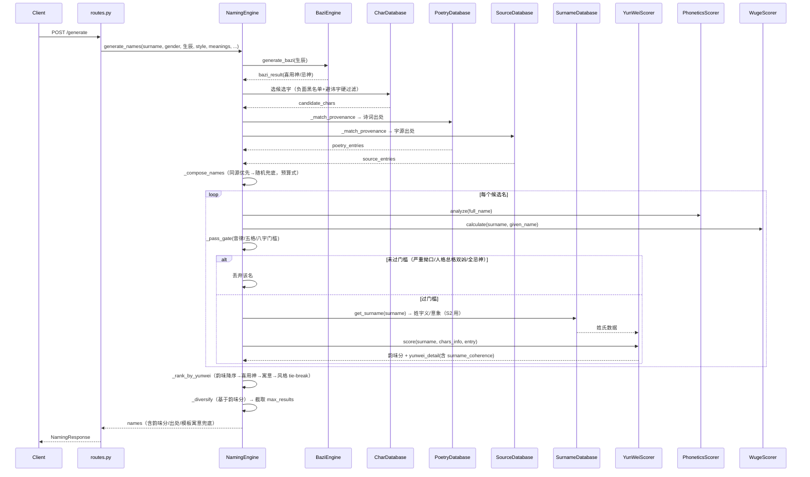
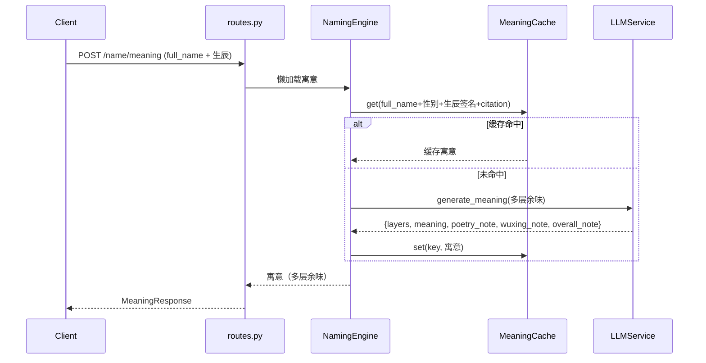
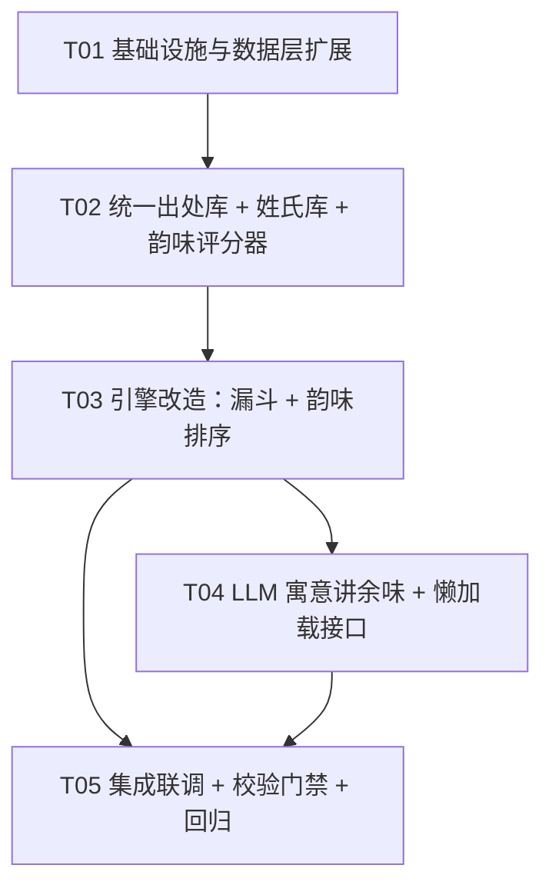

# 名堂 · 起名逻辑重构技术设计

> 架构师：高见远
> 项目：/Users/dongxuhui/Newlife/Newlife/
> 依据：docs/naming_direction.md（产品共识）
> 目标：评分从「加权平均」改「漏斗筛选」，韵味为核心排序，扩展字源，放开意象美生僻字，LLM 讲余味
> 原则：保持四层架构（API → Service → Core → Data），不强加新依赖；韵味评分必须可用数据计算，不能人工主观打分

---

## 0. 现状诊断（关键结论）

1. **评分现状**：`_evaluate_name` 用加权平均 `音律25% + 五格20% + 八字25% + 诗词20% + 基础10%`，四个维度平起平坐，与产品共识「韵味是唯一核心」冲突。
2. **「韵味」无量化**：当前只有 `poetry_score`（同源 25 / 单字 10 / 无 0）这一个粗粒度「出处」信号，没有「意象质量」「余味层数」「同源呼应」的量化。
3. **数据能力已足够支撑韵味量化**（实测）：
   - `poetry.json`：499 首，`imagery/scene/emotion/citation` 覆盖率 **100%**，去重推荐字 459 个且 **100% ∈ chars.json**。
   - `chars.json`：3540 字（《通用规范汉字表》一级字 3500 + 少量），字段含 `meaning/detail/shuowen/radical/kangxi_strokes`，足以做「义项层数」「意象命中」「部首同族呼应」。
   - 也就是说：**韵味评分无需新增字段即可落地**（详见 §2），只有「扩展生僻字/新字源」需要补数据。
4. **LLM 已通未接**：`llm_service.py` 的 `LLMService.generate_meaning()` 已实现（DeepSeek/Qwen/GLM），但 `_generate_meaning` 仍是模板拼接，未接入。
5. **生僻字被"隐性降权"的真正原因**：现有评分没有「生僻」扣分项，但生僻字往往 `meaning/detail` 数据缺失，导致它们在「韵味类」信号上得分低。因此「放开生僻字」的落地前提是 **补齐生僻字的 meaning/detail/出处数据**，而不是简单放开过滤。
6. **姓氏字义数据缺失（本次修正的关键发现）**：实测 chars.json 中常见姓氏字（张/杜/柳/李/徐/王/刘/陈）`meaning` 字段全部为空（`radical/wuxing` 有值）。这意味着「姓+名整体协调」无法靠现有字段评估「姓」的字义，需新增姓氏字典（§2.3 S 维度）。
7. **原文美词未被推荐字覆盖**：实测「杜若」出现在《楚辞·山鬼》`text`「山中人兮芳杜若」中，但该条目 `recommend_chars` 只标了 `["芳","松","柏"]`。故「成词成典」信号必须扫 `text`/`original_text`，不能只依赖 `recommend_chars`（§2.3 S1）。

---

## 1. 总体设计思路

```
3540 字（+ 扩充分级字）
  │
  ├─ 硬过滤层（安全底线，保留现状）：负面字黑名单 + 用户避讳字 + luck=凶 ∪ blacklist.json
  │
  ├─ 第一层门槛（只排除、不打分）：音律严重拗口 / 五格人格总格双凶 / 八字全忌神
  │
  ├─ 通过门槛的候选名
  │
  └─ 第二层排序：韵味（出处 / 意象 / 余味 / 同源呼应）—— 决定谁排前面
         │  韵味同分 tie-break：喜用神命中数 → 寓意命中数 → 风格命中数
         └─ _diversify 多样性重排 → 截取 max_results
```

**三层改造定位（复用/新增/改造标注约定）**：
- 【复用】= 现有代码/数据直接复用，不改或仅读层 `.get()` 兜底
- 【改造】= 现有代码/数据结构需要修改
- 【新增】= 全新文件/字段

---

## 2. 韵味量化方案（核心难点）

### 2.1 设计原则

1. **只用量化可得的信号**，不用「人工主观打分」，也不用 LLM 参与排序（LLM 只在寓意解读阶段"讲余味"，见 §6）。
2. **基于现有字段 + 最小新增**：诗词/字源的 `imagery/scene/citation/recommend_chars/text/original_text` + 字的 `meaning/detail/shuowen/radical` 已可支撑大部分；唯一**必须新增**的数据是「姓氏字典」（见 §2.3 S 维度）——因 chars.json 中姓氏字 `meaning` 为空（实测：张/杜/柳/李/徐/王/刘/陈 均 `meaning=""`），无法用现有字段评估「姓」的字义。
3. **生僻度/常用度/笔画数绝不进入韵味公式**（产品共识：生僻不设限不降权；笔画只在五格门槛中自然体现）。
4. **评估「姓+名」整体，不只评「名」**：起名是「姓+名」的完整组合，姓氏虽固定，但它与名的协调性决定整个名字的韵味（杜若配「杜」浑然一体，配「张」生硬）。
5. **可解释**：每个名字返回 `yunwei_detail`（五维分解），便于调试与用户背书。

### 2.2 韵味公式（五维）

```
韵味分 YunWei = P(出处) + I(意象) + L(余味) + C(名内呼应) + S(姓氏协调) ，满分 100

P 出处分   0~35  名字「有来处」的程度（评「名」）
I 意象分   0~25  名字「有画面」的程度（评「名」）
L 余味分   0~15  名字「藏几层意思」的程度（评「名」）
C 名内呼应 0~10  「名」内部两字「呼应成画」的程度（只评名，不含姓）
S 姓氏协调 0~15  「姓 + 名」整体是否协调、浑然一体的程度（新增，评整体）
```

**权重依据**：产品共识「有余味、有出处、有故事」——出处（有据可循）是产品命脉，权重最高；意象/余味是「名」本身的品质；**姓氏协调 S 是本次修正新增的核心**，它回答「这个名配这个姓是否浑然一体」，与出处同属决定整体韵味的关键；名内呼应 C 只奖励「名」两字的连贯（不含姓，姓的协调由 S 单独评）。

### 2.3 各维度计算规则

#### P · 出处分（0~35）【复用 `entry.recommend_chars`；只评「名」】

| 情形 | 判定 | P |
|------|------|---|
| 同源 | 「名」所有字 ∈ 同一条出处的 `recommend_chars` | 35 |
| 单字有出处 | 「名」至少一个字命中任意出处条目的 `recommend_chars` | 20 |
| 无出处 | 随机组合、无任何 citation | 0 |

- 判定数据：【复用】`entry.recommend_chars`（诗词 + 新字源统一）；只评「名」，不含姓。
- 出处条目来自「诗词库 + 字源库」的并集（§4 统一出处抽象）。

#### I · 意象分（0~25）【复用 `entry.imagery/scene` + `char.meaning/detail` 文本，新增可选 `char.imagery`；只评「名」】

```
意象命中标签数 K = | 去重集合 { tag | tag ∈ entry.imagery ∪ entry.scene 关键词，
                               且 tag 出现在任一「名」字的 meaning/detail/shuowen 文本中 } |
I = min(25, 8 + 4 * K)
```

- 无出处条目时（随机组合）：K = 「名」各字 `meaning` 文本命中 `MEANING_OPTIONS`/`STYLE_OPTIONS` 意象关键词的去重数（复用 §2.5 关键词匹配工具），无则 K=0。
- 【新增可选】`char.imagery: string[]`（字级意象标签），有则优先用它做结构化匹配、无则回退文本匹配。现有 3540 字暂不必补，仅扩展的生僻字随录入一并补（见 §5）。

#### L · 余味分（0~15）【复用 `char.meaning` 义项切分；只评「名」】

```
义项总数 N = Σ 「名」各字 meaning 按「、，,;；」切分后的非空义项数
L = min(15, 4 * N)
```

- 「多层意思」的**数值代理**：`meaning` 义项越多（如「黄金、金属，象征尊贵、坚毅」=3 义项），该字可品出的层次越多。这是可计算的近似，**权威「余味」由 LLM 在寓意阶段输出**（§6）。
- `meaning` 缺失 → 该字义项数计 0（由 P/I/C/S 兜底，不整名归零）。

#### C · 名内呼应分（0~10）【复用 `char.radical`，新增可选 `char.imagery`；只评「名」，不含姓】

```
C = 10  「名」各字 radical 属同一「意象部首族」（见下表）
C = 5   「名」各字 imagery 标签有交集（需 char.imagery，可选）
C = 0   否则
```

**意象部首族映射**（部首 → 意象族，新增到 `naming_options.py` 常量）：

| 意象族 | 部首集合 |
|--------|----------|
| 草木 | 木、艹、禾、竹 |
| 水 | 水、氵、雨 |
| 玉 | 玉、王、石 |
| 金 | 金、钅、刀、刂 |
| 火 | 火、灬、日 |
| 土 | 土、山、田 |
| 日月星辰 | 日、月、星 |

（注：C 只对「名」字做部首/意象判断，**姓氏绝不参与 C**；姓与名的协调性由 S 维度单独评估。）

#### S · 姓氏协调分（0~15）【新增维度；需新增姓氏字典】

评估「这个名配这个姓，整体是否协调、是否浑然一体」。分两个子信号：

```
S = S1 成词成典分（0~10）+ S2 字义/意象呼应分（0~5）
```

**S1 · 成词成典分（0~10）**——「姓+名」是否构成完整词/意象/典实（如「杜若」香草名、「徐长卿」药名）：

| 情形 | 判定 | S1 |
|------|------|----|
| 浑然一体 | `姓+名` 是某出处条目 `text`/`original_text` 的**连续子串**，或 `title`/`citation` 含 `姓+名` | 10 |
| 同源到姓 | `姓` 与「名」所有字同属一个条目的 `recommend_chars` | 6 |
| 无 | 其余 | 0 |

- 判定数据：【新增】`SourceDatabase`/`PoetryDatabase` 加载时预构建「姓+名 连续 n-gram 索引」（对 `text`/`original_text`/`title`/`citation` 抽取 2~3 字 CJK 连词 → 条目），查询 O(1)；数据量仅 499 + 新增字源，线性扫描亦可。
- **关键**：S1 扫的是 `text`/`original_text`，**不是 `recommend_chars`**。实测「杜若」在《楚辞·山鬼》`text`「山中人兮芳杜若」中，但 `recommend_chars` 只标了 `["芳","松","柏"]`——若只按 `recommend_chars` 会漏掉这类「原文中浑然一体的美词」。这正是 S1 用 text 扫描的价值。

**S2 · 字义/意象呼应分（0~5）**——「姓」的字义/意象 与「名」的字义/意象是否同频（不看词，看语义场）：

```
S2 = 5  姓的 meaning/imagery 与 「名」各字的 meaning/detail 或 「名」出处的 imagery 关键词重叠 ≥ 1
S2 = 0  无重叠，或姓无字典数据（兜底）
```

- 判定数据：【新增】`data/dict/surnames.json`（姓氏字典），提供常见姓氏的 `meaning`/`imagery`（`wuxing`/`radical` 复用 chars.json——实测姓氏字这两个字段在字库中是有的，仅 `meaning` 为空）。
- **姓氏字典字段示例**：`{ "char": "杜", "pinyin": "du", "meaning": "杜梨树，一种落叶乔木；引申为杜绝、淳朴", "imagery": ["草木", "杜梨", "质朴"] }`。
- 姓氏未收录 → S2=0（不影响排序，只是不得分）。

**为什么「姓」的五行不单独计分**：姓在单次查询内是固定常量，其五行对所有候选名是同一个常数，进不进公式都不改变排序；且姓的五格笔画已计入 `wuge`、喜用神协调已由八字门槛覆盖。故 S 只评「字义/意象呼应 + 成词成典」，不评姓的五行。

### 2.4 落地示例（证明可计算，按目标数据 T01 接入新字源后）

**例 A：姓「杜」，名「若」**（目标数据：新增字源条目「杜若」`text="杜若，香草，一名杜蘅"`、`recommend_chars=["杜","若"]`、`imagery=["香草","清雅"]`）

- P：杜、若同出「杜若」条目 → 同源 = **35**
- I：名「若」meaning 命中「香草/清雅」→ K=2 → I = min(25, 8+4×2) = **16**
- L：若义项 3 → N=3 → L = min(15, 12) = **12**
- C：单名无「名内」两字呼应 → **0**（单名自然无，符合语义）
- S：S1 = 姓+名「杜若」是 text 连续子串 → **10**；S2 = 姓「杜」杜梨/草木 与「香草」重叠 → **5**；S = **15**
- **韵味 = 35 + 16 + 12 + 0 + 15 = 78**（姓与名浑然一体，S 拉满）

**例 B：姓「张」，名「杜若」**（同样数据，「杜若」作双名）

- P：名「杜若」同出「杜若」条目 → **35**
- I：杜、若命中「香草/清雅」→ K=2 → **16**
- L：杜义项 3 + 若义项 3 = N=6 → min(15, 24) = **15**
- C：名内 杜(木)+若(艹) 同草木 → **10**
- S：S1 = 「张杜若」非任何 text 连续子串 → 0；S2 = 姓「张」弓弦/张开 与「香草」无重叠 → 0；S = **0**
- **韵味 = 35 + 16 + 15 + 10 + 0 = 76**

> 说明：例 A 是单名、例 B 是双名，名部分得分结构不同，但核心差距在 S（15 vs 0）。若统一按双名「杜若」比较（姓「杜」 vs 姓「张」），名部分完全相同（P/I/L/C 一致），唯一差异就是 S=15 vs 0，直观体现「配姓协调」的 15 分权重。实际产品以双名为主，姓名协调差距稳定落在 S 上。

**反例：随机组合「张伟志」**（无出处、义项少、名内不呼应、姓无呼应）→ P=0, I≈8, L≈8, C=0, S=0 → 韵味 ≈ 16，自然沉底。

### 2.5 复用的关键词匹配工具

现有 `NamingEngine._meanings_match_score()` 与 `PrenatalEngine._pref_score()` 已有「关键词命中」逻辑，**抽为一个共享工具** `YunWeiScorer.match_keywords(text, keywords) -> int`，供韵味/寓意/风格/姓氏呼应四处复用（避免重复实现）。

---

## 3. 漏斗筛选改造

### 3.1 门槛阈值（硬排除，不做打分）

三门槛都只返回「通过/不通过」，不再折算成分数参与主排序。

#### 音律门槛【改造 `phonetics.py`，新增 `is_cacophonous()`】

```
排除条件（任一命中即硬排除）：
- rhythm 全平「平平平」或全仄「仄仄仄」
- phonetics.score < 55（连续同调/严重拗口）
```
- 现状 `_calculate_score` 已能产生 score；新增一个布尔信号暴露给引擎，避免引擎重复判断 rhythm。

#### 五格门槛【改造 `wuge.py`，新增 `is_bad()`】

```
排除条件（同时满足才硬排除，避免误杀）：
- ren_ge.luck == "凶" 且 zong_ge.luck == "凶"（人格、总格双凶 = 大凶）
```
- 单凶不硬排（人格凶但总格吉等常见情况放行，只不再计入主排序）。
- 【复用】`wuge.calculate()` 已返回 `ren_ge/zong_ge` 的 luck。

#### 八字门槛【改造 `bazi_engine.py` 返回忌神 / 引擎内判断】

```
排除条件（名字字五行全部落在忌神，即"忌神严重冲突"）：
- 名字所有字 wuxing ∈ ji_wuxing（忌神五行）
  （双名：两字都属忌神；单名：该字属忌神）
```
- 【复用】`bazi_result["xiyong"]["ji_wuxing"]`（`bazi_engine.py` 已产出）。
- 未提供生辰（无八字）→ 八字门槛自动放行。

### 3.2 通过门槛后的完整流程【改造 `naming_engine.py`】

```
1. 黑名单硬过滤（保留现状）
2. 候选字筛选 + 出处匹配（诗词 + 字源，见 §4）
3. _compose_names 预算式组合（保留现状策略：同源优先 → 随机兜底）
   └─ 每个名字 _evaluate_name：
        a) phonetics.analyze / wuge.calculate / bazi 忌神判断
        b) _pass_gate()：任一门槛不通过 → return None（丢弃，不进候选）
        c) 通过 → yunwei.score(surname, chars_info, entry) 计算韵味分（含 S 姓氏协调）+ yunwei_detail
4. 排序：key = (-韵味分, -喜用神命中数, -寓意命中数, -风格命中数)
5. _diversify（改为基于韵味分）→ 截取 max_results → 剥离内部 _tier
```

### 3.3 与 `_diversify`、强加权（style/meanings）的协调【关键设计】

当前 `_build_names` 的排序是 `(tier A/B/C/R, -寓意命中, -overall)`，tier 强加权会「把风格/寓意命中的名字压到前面」。改造后：

1. **风格（style）降级为「选池偏置 + 末级 tie-break」**，不再强加权压过韵味：
   - `_rank_poems` 仍做 tier 分层（A/B/C）——但 tier 只影响**候选池预算式引入顺序**（`_compose_names` 已实现 A→B→C 预算），**不再决定最终排序**。
   - 最终排序中风格命中仅作为最末 tie-break。
2. **寓意（meanings）降级为「选字硬前置 + 二级 tie-break」**：
   - `_select_candidate_chars` / `_get_valid_poem_chars` 保留「寓意命中排前」的**硬前置**（用户明确要「智慧」，命中的字优先进池），但**不压过韵味**。
   - 最终排序中寓意命中作为韵味同分时的二级 tie-break。
3. **`_diversify` 只改排序基准**：从「按 overall 降序」改为「按韵味分降序」，其余贪心逻辑不变（限制同字扎堆、不删名字）。
4. **`overall` 字段语义变更**：`scores.overall` 改为 = 韵味分（主排序依据），同时新增 `scores.yunwei` + `scores.yunwei_detail`，`scores.phonetics/wuge/bazi` 保留用于展示（它们退化为「门槛通过标记 + 展示值」，不再乘权重求和）。

**协调结论**：韵味是唯一主排序；八字（喜用神）→ 寓意 → 风格 依次作为 tie-break；多样性在韵味排序后做贪心重排。三者不冲突。

---

## 4. 字源扩展设计（周易 / 本草纲目 / 神农本草经 / 山海经）

### 4.1 数据形态：独立字源文件（不并入 poetry.json）

**【新增】`data/source/source_entries.json` + `data/source/source_entries.schema.json`**，不并入 poetry.json。理由：

1. 这些是**典籍条目/药名/神兽/植物/地名**，不是「诗句」，`text` 语义（摘句）对不上；并入会污染 poetry.json 的 6 大类枚举与语义。
2. 独立文件 + 独立 schema 便于单独标注、校验、版本管理，且不影响现有 499 首。
3. 通过「统一出处抽象」在引擎层合并（§4.3），对上层透明。

### 4.2 字源条目 Schema（对齐 poetry 字段，语义微调）

```json
{
  "id": "src_0001",
  "source": "本草纲目",              // 典籍名（新枚举）
  "source_class": "经史子集",        // 大类，用于风格/检索兼容
  "category": "中药名",              // 新增：中药名 | 神兽 | 植物 | 地名 | 典籍章句
  "title": "徐长卿",
  "author": "李时珍",
  "dynasty": "明",
  "text": "徐长卿：味辛，温。主鬼物百精……",   // 条目摘录（可短可空）
  "original_text": "……",             // 完整段落（可空）
  "citation": "《本草纲目·草部·徐长卿》",
  "recommend_chars": ["卿", "长"],   // 起名用字（必须 ∈ chars.json 且非负面）
  "emotion": "中性",                  // 喜庆 | 中性 | 哀伤（哀伤条目 recommend_chars 空）
  "imagery": ["草药", "清雅", "仁和"],
  "gender": "中",
  "scene": "香草入药，喻温良仁厚",
  "tags": ["中药名", "香草"],
  "provenance": "manual/ben-cao-gang-mu"
}
```

**字段映射说明**：

| 字段 | poetry | 字源 | 说明 |
|------|--------|------|------|
| `source` | 6 大类 | 典籍名（周易/本草纲目/神农本草经/山海经） | 字源用典籍名做展示出处 |
| `source_class` | （无） | **新增** | 归入「经史子集」，让 `STYLE_OPTIONS.source_preference` 的「经史子集」继续命中 |
| `category` | （无） | **新增** | 药名/神兽/植物/地名 用于检索与差异化 |
| `text` | 摘句 | 条目摘录 | 语义微调，仍是「起名引用句」 |
| `gender` | 男/女/中 | **山海经地名类一律「中」** | 地名/神兽/植物类（望舒、扶苏等）不按传统意象分男女，男女通用 |
| 其余 | — | 复用 | id/citation/emotion/imagery/scene/tags/provenance 语义一致 |

**性别标注规则（产品拍板）**：山海经「地名」类字源（望舒、扶苏等）`gender` 一律标 `"中"`，男女都可用，不按传统意象分男女；本草纲目/神农本草经「中药名」类（徐长卿、白芷、青黛等）与诗词沿用「按意象判男女/中性」规则。

### 4.3 统一出处抽象 + 引擎衔接

- **【新增】`app/services/source_database.py` → `SourceDatabase`**：镜像 `PoetryDatabase` 接口（`get_by_char/get_by_source/get_by_gender/get_all/filter`），读层 `normalize()` 补默认值。
- **【新增】`SourceDatabase` 预构建「姓+名 连词索引」**：加载时对 `text/original_text/title/citation` 抽取 2~3 字 CJK 连续 n-gram → 条目映射，供 §2.3 S1 成词成典 O(1) 查询；`PoetryDatabase` 同步补一个 `get_by_fullname_ngram()`（或由引擎层合并两库索引）。
- **【改造】`naming_engine.py`**：新增 `_match_provenance()` 统一返回 `poetry_entries + source_entries`（都归一为「出处条目」dict，含 `source_class`/`citation`）。`_compose_names` 与 `_evaluate_name` 改为消费统一条目，**不再区分「诗词出处」与「字源出处」**。
- **【改造】`poetry_database.py`**：`normalize()` 增加 `source_class` 字段兜底（现有 499 首按 `source` 直接作为 `source_class`，即 6 大类即其大类）。
- **【改造】`_rank_poems`**：风格 tier 匹配的 `source in source_preference` 改为 `(source in source_preference) or (source_class in source_preference)`，保证字源也能被「古风雅致」等风格命中。

**出处标注如何衔接**：每个名字的 `poetry` 字段（返回给前端）统一用 `citation` 做「出处标注」，`source/title/text` 做展示；LLM 寓意提示词同时吃 `citation + text + scene + imagery`（§6），让 LLM「讲余味」有据可依、不编造。

---

## 5. 生僻字放开

### 5.1 数据层扩充【新增数据 + 复用现有脚本】

- **【改造】`chars.json` 新增 `level` 字段**（仅数据治理，**绝不参与评分**）：`"一"（一级字）/ "二"（二级字）/ "扩展"（意象美生僻字，来自山海经/本草纲目等）`。
- **【新增】`scripts/expand_rare_chars.py`**：复用现有 `expand_char_db.py` 的流水线（康熙笔画 + pypinyin 拼音/声调 + 部首→五行 + 默认 luck=吉），**全量引入《通用规范汉字表》二级字表 3000 字（方案 A，已拍板）** + 从新字源 `recommend_chars` 收集的**意象生僻字**（如 徐长卿/白芷/青黛/半夏/杜若/白薇/黄芪/望舒/扶苏 等）。**关键：新字一律默认 luck=吉，仅负面义入黑名单，不因生僻标凶。**
- **【新增】`scripts/enrich_rare_chars.py`**：为新扩充字补 `meaning/detail/shuowen/imagery`，**用 LLM 批量标注（复用 `llm_annotator` 模式，预算已同意）**。**这是放开生僻字的落地前提**——生僻字必须带齐意象/出处数据，否则会在韵味上因「数据贫乏」而非「生僻」被排低。

### 5.2 评分层「不因生僻降权」

- 韵味公式（§2）**不含任何生僻度/常用度/笔画项**，天然不降权。
- 硬过滤层只保留「负面黑名单」（安全底线），**不新增「生僻字过滤」**。
- 唯一风险是数据贫乏，已由 §5.1 的 `enrich_rare_chars` 补齐 + §7 韵味兜底覆盖。

---

## 6. LLM 寓意「讲余味」

### 6.1 调用时机：详情页懒加载（不在 /generate 实时调用）

- `/generate` 返回名字列表时，`meaning` 用**轻量模板兜底**（保留现有 `_generate_meaning` 作为 fallback），**不调 LLM**（20~50 个名字实时调 LLM = 慢 + 贵）。
- **【新增】`POST /name/meaning`**：用户点进某个名字详情时，对**单个名字**调一次 LLM，生成「多层余味」寓意。

### 6.2 费用控制

- **只在详情页对单名调用**（每个名字最多 1 次实时 + 缓存复用）。
- **【新增】`app/services/meaning_cache.py` → `MeaningCache`**：内存 LRU + 可选文件缓存（`data/meaning_cache/*.json`），缓存 key = `full_name + gender + 生辰签名 + citation`。命中缓存直接返回，不重复付费。
- 可选开关：`with_llm_meaning=True` 时对 top K（默认 3）个名字预生成，其余懒加载；默认关闭。

### 6.3 提示词改造【改造 `llm_service.py` 的 `_build_prompt`】

输入：`full_name + chars_info(meaning/detail/shuowen) + citation/text/scene/imagery + 八字喜用神`。

输出（JSON，多层结构）：

```json
{
  "layers": [
    {"level": "字面", "text": "……"},       // 第一层：字义本身
    {"level": "出处", "text": "……"},       // 第二层：典故出处、原文意境
    {"level": "余味", "text": "……"}        // 第三层：意象联想、藏的几层意思
  ],
  "meaning": "2~3 句话的整体解读",
  "poetry_note": "出处意境与名字的关联",
  "wuxing_note": "五行与喜用神匹配（无八字则只分析名字五行）",
  "overall_note": "一句话点睛"
}
```

**提示词要点**：
1. 严格基于给定数据，**不得编造不存在的诗句/出处**（复用现有约束）。
2. 必须「层层递进」：先字面义，再典故义，最后点出意象联想与余味，**讲出「藏了几层意思」**。
3. 语言典雅但不晦涩，普通家长能看懂。
4. 规避「算命/命运/预测」等词（复用现有约束）。
5. 每个 layer 一句话、言之有物、不空泛、不堆砌。

---

## 7. 数据校验与兜底

### 7.1 校验规则【新增 `scripts/validate_source_entries.py`，复用 `validate_poetry.py` 思路】

| 规则 | 内容 | 级别 |
|------|------|------|
| R1 | `recommend_chars` 每个字 ∈ chars.json（扩充后字库） | 硬错误 |
| R2 | 每个推荐字 luck ≠ 凶 且 非负面黑名单 | 硬错误 |
| R3 | `citation` 非空且含《…》 | 警告 |
| R4 | `source` ∈ {周易, 本草纲目, 神农本草经, 山海经}；`source_class` = 经史子集 | 硬错误 |
| R5 | `emotion` ∈ {喜庆, 中性, 哀伤}；哀伤条目 `recommend_chars` 为空 | 硬错误 |
| R6 | `category` ∈ {中药名, 神兽, 植物, 地名, 典籍章句} | 警告 |
| R7 | `imagery` 非空（韵味意象分依赖） | 警告 |
| R8 | `id` 全局唯一；按 (source,title,text) 去重 | 硬错误 |

### 7.2 韵味评分兜底

`YunWeiScorer.score()` 内部对缺失字段逐维度降级，**保证任何名字都能算出分数、可排序**：

| 缺失 | 兜底策略 |
|------|----------|
| 无出处条目 | P=0，I 回退用字 `meaning` 文本匹配内置意象关键词 |
| `imagery` 缺失 | 意象分回退文本关键词匹配 `meaning/detail` |
| `meaning` 缺失 | 该字义项数=0，L 靠其余字 |
| `radical` 缺失 | C=0 |
| 姓无字典数据 | S2=0（S1 成词成典不受影响，仍可算） |
| 姓+名连词索引未命中 | S1=0（无成词成典） |
| 全部缺失 | 韵味 = P（同源35/单字20/无0），仍可排序 |
| 兜底后同分 | 保持 `_compose_names` 的稳定输入顺序（稳定排序） |

### 7.3 LLM 兜底

- LLM 失败/超时 → 回退模板 `_generate_meaning`（现有逻辑），并置 `meaning_source="template"`；成功置 `meaning_source="llm"`。

---

## 8. 文件清单

### 新增文件
| 路径 | 说明 |
|------|------|
| `data/source/source_entries.json` | 新字源条目（周易强化/本草纲目/神农本草经/山海经） |
| `data/source/source_entries.schema.json` | 字源 schema |
| `data/dict/surnames.json` | 姓氏字典（meaning/imagery，供 S 姓氏协调） |
| `app/services/source_database.py` | 字源库服务（含「姓+名 连词索引」） |
| `app/services/surname_database.py` | 姓氏字典服务（供 S2 字义呼应） |
| `app/services/yunwei_scorer.py` | 韵味评分器（核心，五维含 S） |
| `app/services/meaning_cache.py` | LLM 寓意缓存 |
| `scripts/expand_rare_chars.py` | 全量引入二级字 3000 + 意象生僻字 |
| `scripts/enrich_rare_chars.py` | LLM 批量补生僻字 meaning/detail/shuowen/imagery |
| `scripts/validate_source_entries.py` | 字源校验门禁 |

### 改造文件
| 路径 | 改造点 |
|------|--------|
| `app/services/naming_engine.py` | 漏斗门槛 + 韵味排序（含 S 姓氏协调入参）+ 统一出处 + tie-break 协调 |
| `app/services/phonetics.py` | 新增 `is_cacophonous()` 信号 |
| `app/services/wuge.py` | 新增 `is_bad()` 信号 |
| `app/services/poetry_database.py` | `normalize()` 补 `source_class` + `get_by_fullname_ngram()` 连词索引 |
| `app/services/llm_service.py` | 提示词改多层余味 |
| `app/core/config.py` | 新增 `SOURCE_DIR/SOURCE_ENTRIES_FILE/SURNAME_DB_FILE` + 门槛/韵味常量 |
| `app/core/constants.py` | 新增 `SOURCE_CLASS_ENUM/RARE_CHAR_LEVELS/部首意象族映射/姓氏枚举` |
| `app/core/naming_options.py` | 新增韵味权重（五维）、门槛阈值、意象部首族常量 |
| `app/api/routes.py` | 新增 `POST /name/meaning` |
| `app/schemas/schemas.py` | 新增 `MeaningRequest/MeaningResponse`、扩展 `scores`（含 `yunwei_detail.surname_coherence`） |
| `scripts/validate_poetry.py` | 兼容新字源/新字段 |

---

## 9. 数据结构和接口（classDiagram）

```mermaid
classDiagram
    class NamingEngine {
        +char_db: CharDatabase
        +poetry_db: PoetryDatabase
        +source_db: SourceDatabase
        +surname_db: SurnameDatabase
        +yunwei: YunWeiScorer
        +phonetics: PhoneticsScorer
        +wuge: WugeScorer
        +bazi: BaziEngine
        +llm: LLMService
        +cache: MeaningCache
        +generate_names(surname, gender, year, ...) dict
        -_build_names(...) tuple
        -_select_candidate_chars(xiyong_wuxing, gender, ...) list
        -_match_provenance(xiyong_wuxing, gender, style, meanings, blacklist) list
        -_compose_names(...) list
        -_evaluate_name(surname, given_name, chars_info, entry, bazi_result) dict
        -_pass_gate(phonetics, wuge, bazi, chars_info) bool
        -_rank_by_yunwei(names, meanings, style) list
        -_diversify(names, max_same_char) list
    }
    class YunWeiScorer {
        +score(surname, chars_info, entry) dict
        -_provenance_score(chars_info, entry) int
        -_imagery_score(chars_info, entry) int
        -_aftertaste_score(chars_info) int
        -_coherence_score(chars_info) int
        -_surname_coherence_score(surname, chars_info, entry) dict
        +match_keywords(text, keywords) int
    }
    class SourceDatabase {
        -_entries: list
        -_fullname_ngram: dict
        +normalize(entry) dict
        +get_by_char(char) list
        +get_by_source(source) list
        +get_by_gender(gender) list
        +get_by_fullname_ngram(surname, given_name) dict
        +get_all() list
    }
    class SurnameDatabase {
        -_surnames: dict
        +get_surname(char) dict
    }
    class PoetryDatabase {
        -_poems: list
        +normalize(poem) dict
        +get_by_char(char) list
        +get_by_source(source) list
        +get_by_gender(gender) list
        +get_by_fullname_ngram(surname, given_name) dict
    }
    class CharDatabase {
        -_chars: list
        -_char_map: dict
        +get_char(char) dict
        +get_by_wuxing(wx, gender) list
        +get_all() list
    }
    class WugeScorer {
        +calculate(surname, given_name) dict
        +is_bad(result) bool
    }
    class PhoneticsScorer {
        +analyze(name) dict
        +is_cacophonous(result) bool
    }
    class BaziEngine {
        +generate_bazi(year, month, day, hour, minute, gender) dict
    }
    class LLMService {
        +chat(messages, temperature, max_tokens, json_mode) dict
        +generate_meaning(full_name, chars_info, entry, bazi_data, gender) dict
    }
    class MeaningCache {
        +get(key) dict
        +set(key, value) None
    }

    NamingEngine --> CharDatabase
    NamingEngine --> PoetryDatabase
    NamingEngine --> SourceDatabase
    NamingEngine --> SurnameDatabase
    NamingEngine --> YunWeiScorer
    NamingEngine --> WugeScorer
    NamingEngine --> PhoneticsScorer
    NamingEngine --> BaziEngine
    NamingEngine --> LLMService
    NamingEngine --> MeaningCache
    YunWeiScorer --> SurnameDatabase
```



---

## 10. 程序调用流（sequenceDiagram）

### 10.1 起名主流程（漏斗筛选 + 韵味排序）



### 10.2 LLM 寓意懒加载（讲余味）



---

## 11. Required Packages（第三方依赖）

**无新增第三方依赖**（约束：不强加新依赖）。复用现有：`fastapi / pydantic / pydantic-settings / httpx / pypinyin / lunardate`。韵味评分纯 Python 字符串/集合运算实现。

---

## 12. 任务分解（≤5 个，按依赖排序）

> 说明：本项是既有 Python/FastAPI 后端的**重构**，非 greenfield。「基础设施」落在 T01（配置 + 数据层地基），作为后续所有任务的公共依赖。

### T01 · 基础设施与数据层扩展（配置 + 字库扩充 + 字源文件 + 校验脚本）
- **Task ID**: T01
- **优先级**: P0
- **依赖**: 无
- **Source Files**:
  - `app/core/config.py`【改造】新增 `SOURCE_DIR/SOURCE_ENTRIES_FILE/SURNAME_DB_FILE` + 门槛/韵味常量
  - `app/core/constants.py`【改造】新增 `SOURCE_CLASS_ENUM/RARE_CHAR_LEVELS/部首意象族映射/姓氏枚举`
  - `app/core/naming_options.py`【改造】新增韵味权重（五维含 S）、门槛阈值、意象部首族常量
  - `data/source/source_entries.json`【新增】新字源数据（周易强化/本草纲目/神农本草经/山海经；山海经地名类 gender 一律「中」）
  - `data/source/source_entries.schema.json`【新增】字源 schema
  - `data/dict/surnames.json`【新增】姓氏字典（常见单姓+复姓的 meaning/imagery）
  - `data/dict/chars.json`【改造】新增 `level` 字段 + 全量引入二级字 3000 + 意象生僻字
  - `scripts/expand_rare_chars.py`【新增】全量扩充二级字 + 意象生僻字（方案 A，已拍板）
  - `scripts/enrich_rare_chars.py`【新增】LLM 批量补生僻字 meaning/detail/shuowen/imagery（预算已同意）
  - `scripts/validate_source_entries.py`【新增】字源校验门禁

### T02 · 服务层：统一出处库 + 姓氏库 + 韵味评分器
- **Task ID**: T02
- **优先级**: P0
- **依赖**: T01
- **Source Files**:
  - `app/services/source_database.py`【新增】字源库服务（镜像 PoetryDatabase + 「姓+名 连词索引」）
  - `app/services/surname_database.py`【新增】姓氏字典服务（供 S2 字义呼应）
  - `app/services/yunwei_scorer.py`【新增】韵味评分器（P/I/L/C/S 五维 + 兜底）
  - `app/services/poetry_database.py`【改造】`normalize()` 补 `source_class` 兜底 + `get_by_fullname_ngram()` 连词索引
  - `app/services/char_database.py`【改造】支持 `level/imagery` 查询（可选）

### T03 · 引擎改造：漏斗筛选 + 韵味排序（核心逻辑重构）
- **Task ID**: T03
- **优先级**: P0
- **依赖**: T02
- **Source Files**:
  - `app/services/naming_engine.py`【改造】`_pass_gate/_rank_by_yunwei/_match_provenance`，重写 `_evaluate_name` 评分段（把 `surname` 传入 `yunwei.score` 计算 S 姓氏协调），协调 `_diversify` 与强加权
  - `app/services/phonetics.py`【改造】新增 `is_cacophonous()`
  - `app/services/wuge.py`【改造】新增 `is_bad()`
  - `app/services/bazi_engine.py`【改造】暴露忌神冲突信号（或引擎内判断）
  - `app/schemas/schemas.py`【改造】扩展 `scores`（新增 `yunwei/yunwei_detail`，其中 `yunwei_detail.surname_coherence` 分解 S1/S2）

### T04 · LLM 寓意讲余味 + 懒加载接口
- **Task ID**: T04
- **优先级**: P1
- **依赖**: T03
- **Source Files**:
  - `app/services/llm_service.py`【改造】提示词改多层余味（layers 结构）
  - `app/services/meaning_cache.py`【新增】LRU + 文件缓存
  - `app/services/naming_engine.py`【改造】`_generate_meaning` 模板兜底 + LLM 懒加载入口
  - `app/api/routes.py`【改造】新增 `POST /name/meaning`
  - `app/schemas/schemas.py`【改造】新增 `MeaningRequest/MeaningResponse`

### T05 · 集成联调 + 数据校验门禁 + 回归测试
- **Task ID**: T05
- **优先级**: P1
- **依赖**: T03, T04
- **Source Files**:
  - `tests/test_core.py`【改造/新增】韵味评分、漏斗门槛、兜底、LLM 懒加载测试
  - `scripts/validate_poetry.py`【改造】兼容新字源/新字段校验
  - `scripts/validate_source_entries.py`【改造】与 T01 脚本联调，接入 CI Gate
  - `app/main.py`【改造】（如需）注册新路由

---

## 13. Shared Knowledge（工程约定）

- **评分语义变更**：`scores.overall` 从「加权平均」改为「韵味分」，前端排序逻辑沿用 `overall` 即可平滑过渡；`scores.phonetics/wuge/bazi` 退化为展示值 + 门槛通过标记。
- **韵味五维可解释**：`scores.yunwei_detail = {provenance, imagery, aftertaste, coherence(名内), surname_coherence(S1/S2)}`，其中 `coherence` 只评「名」内部、`surname_coherence` 只评「姓+名」整体，二者边界严格区分。
- **所有数据读层 `.get()` 兜底**：新增字段一律在 `normalize()` 补默认值，保证新旧数据混用不抛 KeyError。
- **所有出处条目统一接口**：`poetry` 与 `source` 合并为「出处条目」dict（含 `source_class/citation`），引擎不再区分来源类型。
- **姓氏字义来自姓氏字典**：`data/dict/surnames.json` 提供姓的 `meaning/imagery`（chars.json 中姓氏 `meaning` 为空，不能复用）；姓未收录 → S2=0。
- **负面黑名单是唯一安全底线**：`NEGATIVE_CHARS ∪ 用户避讳字 ∪ luck=凶 ∪ blacklist.json`，任何新字源/生僻字都过这一关。
- **生僻度/常用度/笔画数不进韵味公式**，`level` 字段仅数据治理用途；二级字全量引入（方案 A）。
- **LLM 仅在详情页懒加载**，`/generate` 不调 LLM；LLM 失败回退模板寓意；生僻字 meaning/detail 用 LLM 批量标注。
- **枚举改动双端同步**：`naming_options.py` 改动需同步 `miniprogram/utils/api.js`（现有约定）。

---

## 14. 任务依赖图



---

## 15. 待明确事项（Anything UNCLEAR）

> 已拍板（本次修订吸收）：① 生僻字**全量引入二级字 3000 字**（方案 A）；② 生僻字 meaning/detail **用 LLM 批量标注**（预算同意）；③ 山海经「地名」类字源（望舒、扶苏等）`gender` 一律标「中」。以下为仍待确认项：

1. **韵味权重（35/25/15/10/15）与门槛阈值（音律<55、人格总格双凶、全忌神）**：均为初始值，需在 T05 用真实用例回归校准；「全忌神」是硬排除还是仅降权，建议产品 owner 确认。
2. **姓氏字典覆盖范围与标注方式**：本设计覆盖百家姓前 100 单姓 + 常见复姓 + 新字源中可作姓的字；`meaning/imagery` 标注是人工、还是复用 LLM 批量标注（成本已含在生僻字标注预算内还是另计），需确认。
3. **`overall` 字段兼容策略**：前端当前是否只读 `scores.overall`？若读其他字段需同步评估影响面。
4. **LLM 缓存持久化**：本设计默认内存 LRU + 可选文件缓存，不做 Redis；若需跨实例/跨进程缓存需另行确认（违反「不强加依赖」）。
5. **单名（名字一字）时 S 与 C 的语义**：C 名内呼应、S1 成词成典在单名下会有结构性低分（单名无「名内」两字），需确认单名是否仍按同一公式，或对单名做权重归一（避免单名系统性偏低）。

---

*（本设计为技术方案，供工程师实现；实现中如遇数据/字段缺失，按 §7 兜底策略降级处理。）*
